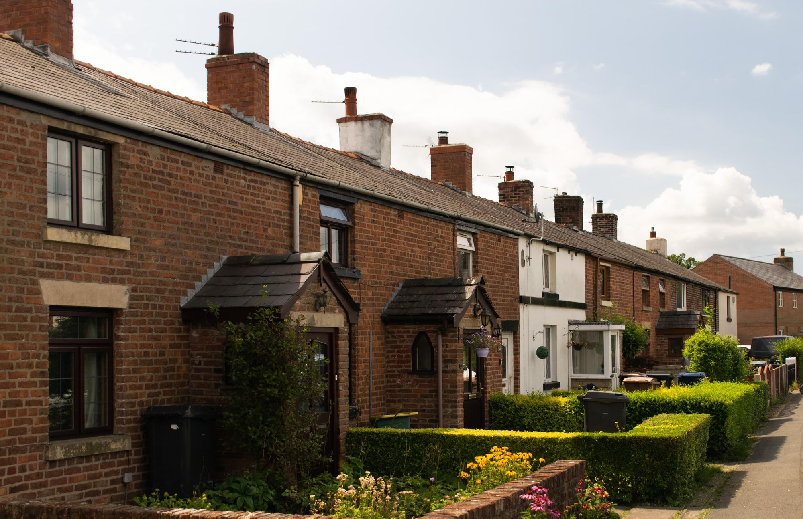
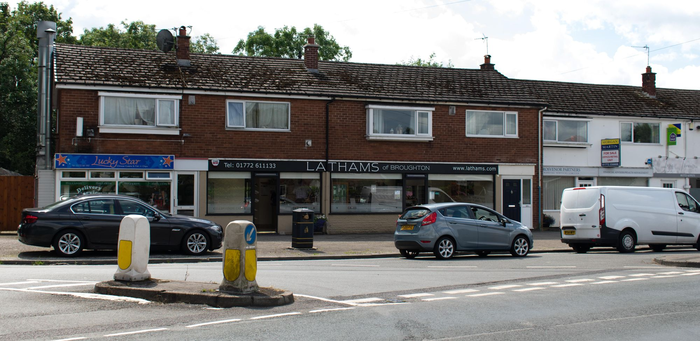

Arriving in the Manchester International Airport was less stressful than I initially anticipated it to be - we got through customs without even talking to anyone, got our bags within the next 10 minutes, and met up with my Aunt. In terms of sleepiness, the excitement of meeting everyone overcame that feeling for the first few hours. When we landed, mind you, it was 7:30am so I had a whole day to get through (after having got no sleep on the plane…). To help keep moving and stay awake, we took a nice walk around the block. I grabbed my camera, and we were off:

On the tail end of our walk, we stopped at the local Latham’s for some sandwiches and sausage rolls.

