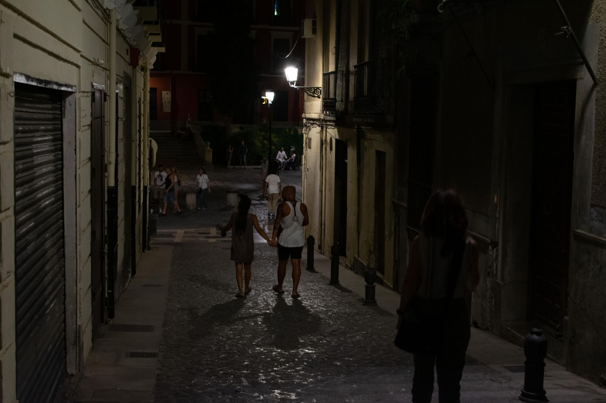
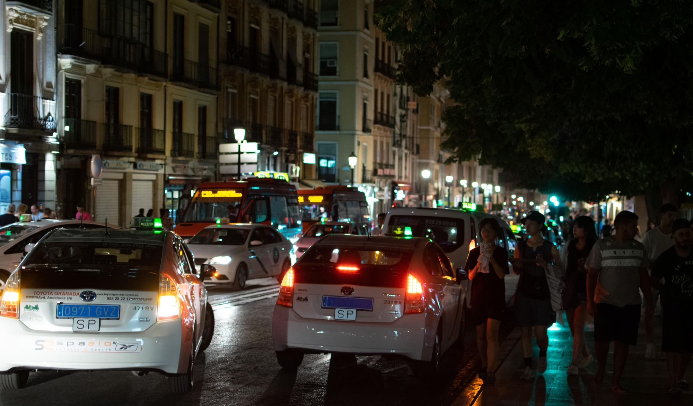

The next step in our European adventure takes place in the lovely city of Granada, Spain. Our flight from Manchester was only a short 2.5 hours, and customs in Granada was a breeze (the customs agent was super cool, he gave me a stamp). Getting off the plane, we were met with the beautiful Granada sun, pictured above in all it's glory.

Our driver was prompt, and spoke little English which was to be expected. It seemed as though he and his wife were traveling together. Once we arrived at one of the principle streets in downtown Granada, we were told that we must continue our journey to the hotel on foot. We tipped the driver, and his wife accompanied us all the way to the entrance of the hotel. This is where we got our first glimpse of the labyrinth of streets that zig-zag all over Granada. As you turn the first corner, the hustle and bustle of the principle street disappears, and you are me with a much quieter, serene walk. The streets are just wide enough to fit a small car, although I would never want to be tasked with driving down them.

Within minutes, we were at the hotel. We checked ourselves in, and decided that we should go out and try some of the famous tapas that we had read so much about.

Getting back out to the main road wasn’t difficult, however deciding where to eat was. There are tapas bars everywhere. In order to give us a better idea, I tried to consult Google Maps for some of the best places to get tapas in the area. Los Diamantes was the first place on the list. We looked around, and it was right across the street from where we were standing - yay, food! But we entered the bar and there were no empty tables in sight - sad, no food. In addition to this, the overwhelming stench of seafood put my mom off, so we decided to try someplace else. Next on the list was Los Manueles. We entered, and once again were met with a lack of empty tables (you can see a theme, here…) The waitress we spoke to said 5-10 minutes for a table, but when a table finally opened up the folks behind us in line took it. I guess we needed to be more aggressive… Anyways, with each tapas bar, we slowly learned more about tapas culture, and we decided to leave once again to try one last place before giving up and calling it a night (keep in mind that at this point, it was already 11:00pm and we were tired from a day’s travel). The final tapas bar we tried was Bodegas Castaneda, about a five minute walk from Los Manueles. We finally got a table outside! Yay. A quick look over the menu prompted my mom to order a glass of Sangria and tapas frias to share. I quite enjoyed the variety of meat and cheese on toast, although my mom was not too keen (she did enjoy the pate, though). It was also relatively expensive for the amount of food you got - about 16 Euros for the medium plate. Oh well, for night one, I thought we did alright. After the bill was paid, we were off to bed.
