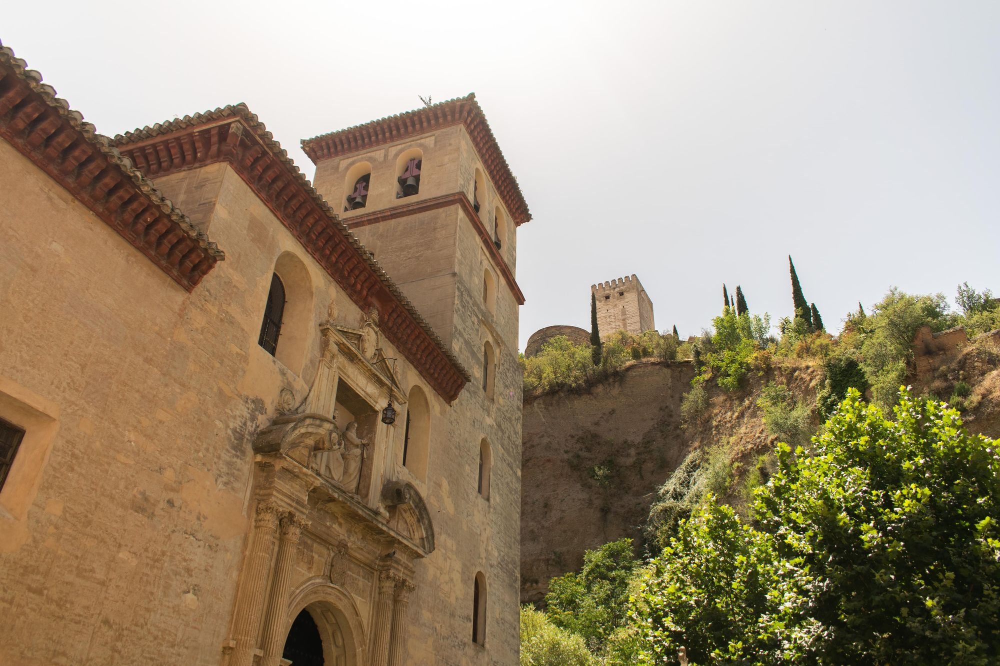

After an exhausting night before, my mom and I weren’t particularly quick to get out of bed. We dragged ourselves downstairs by 10:30am before the breakfast closed at 11. The breakfast was what you would expect from a standard European hotel - lots of cheeses and cold meats, alongside juice and pastries.

We had originally planned for this day to be a quiet day to familiarize ourselves with the city, and that is almost exactly what it ended up being. After talking with the concierge, the decision was made that we would scratch our planned hike for tomorrow seen as it would be awfully expensive to get transportation there and back (roughly 100 Euros). Instead, my mom found this highly-rated night walking tour of Granada through the company Six Thrills. All I will say for now is that we were incredibly pleased with the tour, and you should definitely utilize their services if you are in the area :).

We left the hotel and started to explore.

Many of the small, open shops you find in Granada have the same types of inventory as each other. Nonetheless, the tapestries are eye-catching, as my mom found just minutes into the start of our adventure:

Once you are out onto the main street, you have many options on where to go next - we chose to go left, and walk alongside El Rio de Darro, which is the river that surround the Alhambra. The walk is beautiful, with multiple quaint shops and tapas bars (of course) as you go East.

El Rio de Darro is not a big river - in fact, I think “moat” better describes it. Nonetheless, it inspires the growth of lots of greenery down this road. 

Fitting with the theme of Granada as a whole, cars and buses tend to drive down this small road forcing pedestrians to either side of the road as they pass.

As you continue walking down this main street, it will eventually open up to a larger walking path to the right, and the road widens. Soon enough, you will catch your first glimpse of the Alhambra. It is difficult to see from such a low angle, but it is unmistakable nonetheless:

Once we found the gates to the Alhambra further up the walkway, we decided to turn around and head back towards the hotel. We made a couple of stops along the way in order to look at the menus of some restaurants. There was also an adorable dog just soaking up the sun, so of course I had to go say hi:

Something I did not at all expect was the beauty of simply walking through the city. You do not really find a contrast of modern/traditional style buildings - everything is just beautiful. This I believe is in part due to the UNESCO heritage protections. Much of Granada is protected for a variety of different reasons.

We eventually ventured towards El Centro - the center of the city. This is where you will find many department stores / modern clothing shops. Just before you get to El Centro, there is a small square with a hotel and many roads that converge onto the main street. We found a restaurant that we might try later called Wild Food - it is a Vegan restaurant, so it should be interesting. As it turns out, vegetarian food/tapas are very popular around here.

### The Nighttime Adventure Tour

So, as I kinda mentioned above, we shifted our plans around and signed up for this “Night Adventure Tour,” which was described on Trip Advisor as a 3 hour walking tour of Granada at night. Sounds good. And the reviews were really good as well, so that is exciting. Before meeting for this tour, we ate dinner at a place called Carmela, near the vegan restaurant I mentioned. It was pretty good, and my mom found a new bottle of vino blanco she likes (I forget the name :o). Anyways, we met at the Sixthrills office and we were off with our tour guide Marija.

The tour started off on a good note for one main reason - there were only 3 other people on the tour besides us :D Yay! Marija took us up some of the winding streets of Granada towards our first viewpoint. She said that on Friday nights, it is exceedingly common for there to be hoards of hippies coming up to these viewpoints to smoke weed (despite its illegality). That said, there were only a couple of people at the first viewpoint, and they were indeed relaxing as one might say. This first viewpoint was overlooking Granada, but specifically the Alhambra in all of its glory:

We continued to climb up the winding streets, and were met with some cops who had busted the aforementioned hippies for smoking weed. Cool. Marija said that the police don’t often bother with marijuana possession, and that was the first time in her three years of residence where she had seen a legal altercation regarding weed. Cool. 

As I kinda talked about earlier, something so incredible about this city is the beauty of the buildings. Everywhere you looks, there is architectural eye candy. Eventually we made it up to the most popular, and most touristy, Alhambra viewpoint. I got my photo, and got out of there quick:

Marija told us there would be no shortage of Alhambra views, and she was definitely right. Moving on, we continued to venture up towards Sacromonte, which is the region of Granada home to the Gypsies. During this leg of the journey, we passed by many houses known as las carmenas. Each house called “carmen” was built to be self sustaining, with a large walled garden, grape vines growing on top, etc. They were absolutely beautiful. We stopped at a very quiet and peaceful bar for more views of the Alhambra as the sun set:

Finally, we made our way up to the tallest point in Granada, which is a church at the top of the hill, and I was able to get some final pics before we head back home for the night:

Anyways, that was day one - it was incredible :)
