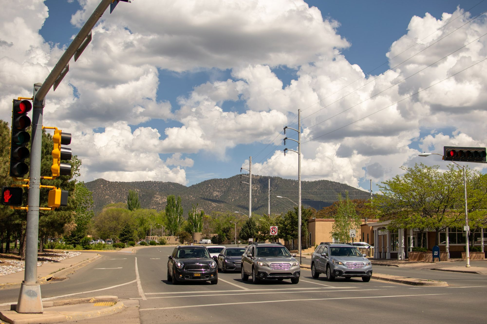

## On Plane #1

The only new thing about the airport is that KCI is getting a new terminal, but we were not in that terminal (it is only halfway done) so we just saw it from the outside. The last flight I had been on was about a year and a half ago in December of 2019, but the experience has not changed much except for that masks are a distinct requirement everywhere. My energy for the rest of the day sort of peaked right before boarding time for flight #1 to Dallas Love Field - after that I just wanted to get to our home base. I will say the flights went by fast, but having to wait in Albuquerque for our bags was rather dreadful, and it felt like each step after that took longer than the entire trip up to that point; we finally found our rental car and bid Albuquerque adieu as Santa Fe was our final destination.
Once we got to Santa Fe, we had to get the house keys from the lock-box and then find our unit (something that gave us more trouble than it should have). In the dark, we couldn't really associate the location on Google Maps with where we were supposed to turn into, but on the second time around the block we found it and could officially say we had arrived! Bags were unloaded, house was presented beautifully and is going to be perfect for our stay, and we were swiftly off to bed as it was nearing 1:30 Kansas-time and both mom and I were pooped.

## 
The Next Morning...

I only got about 7 hours of sleep last night however I feel wide awake and ready to start this adventure! I think our first order of business today is going to be to acquire some basic food items to make ourselves breakfast, etc. We plan on going to the farmer's market in a couple of days, and I will most likely make dinner on that day as well. After scouting out some grocery stores, Trader Joes is probably where we will end up going to, but we will see - my hope was there would be something in direct walking distance and I could go acquire food before mom woke up, but in retrospect it makes the most sense for us to go together in case there is something she needed that I didn't consider. Given the rather exhausting day prior, I think we plan on scouting out the area and doing some more granular planning for the days to come, but I will add another update towards the end of the day with details.

## 
Day One Complete!

We took the day by storm! After a leisurely breakfast, we stopped by the local Kroger derivative (Smith's) to get some basics for the week and then decided to walk the plaza for a lay of the land. One of the first galleries we walked by (of many, many more) had a cool dragon on the roof pictured below: 

Meandering through the streets, my mom and I were met with a series of public sculptures, all of which had differing representations, meanings, and histories:

Also, given the daylight that we didn't have when we landed, the incredible views surrounding Santa Fe came to light. Being able to look out and see some varied elevation is always exciting for Kansans:

The stucco-centric buildings and the distinct architecture in general never really gets old. I was impressed with how clean everything is and generally how beautiful so many of the homes and buildings are:

Lastly, right outside of our rental is this beautiful church that was having service this morning:

So that wraps up day one of Santa Fe - tomorrow is a day of hiking at the Bandelier National Monument.
