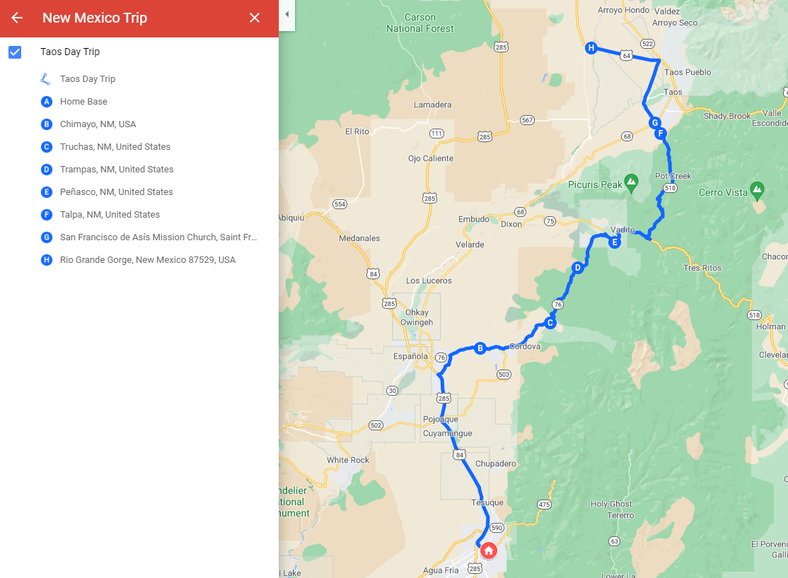
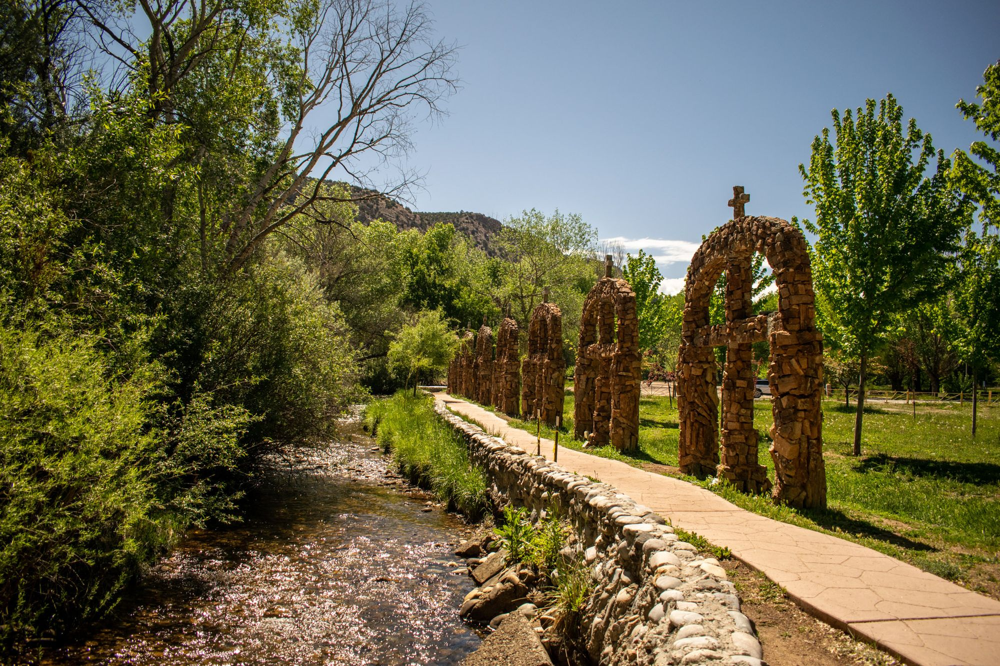
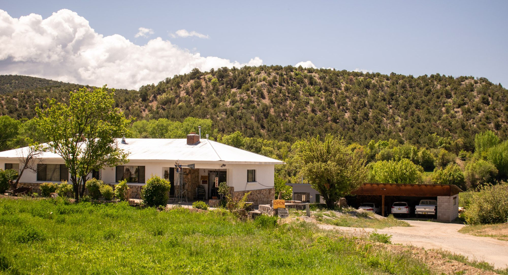
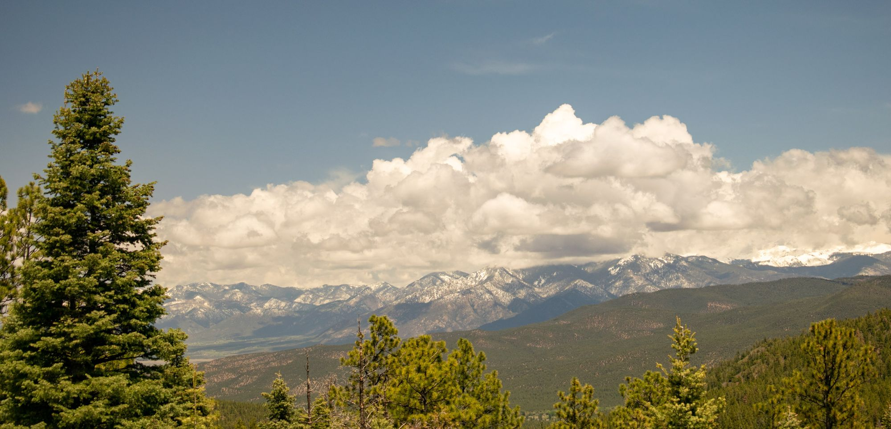
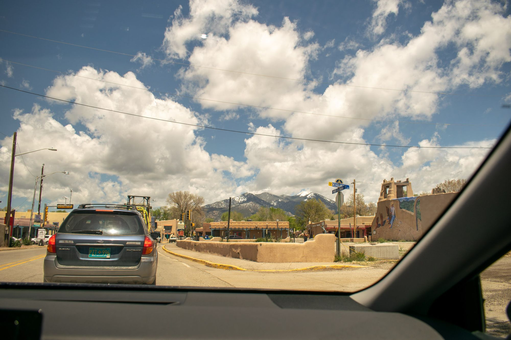
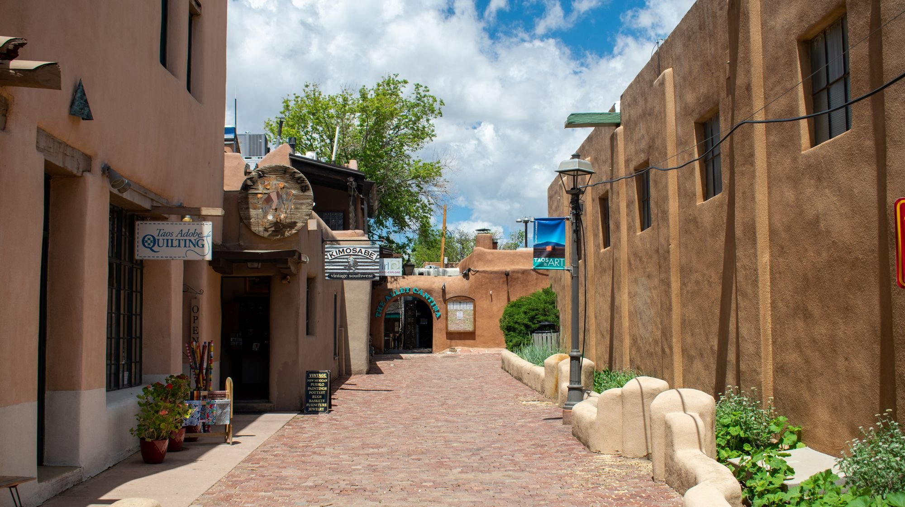
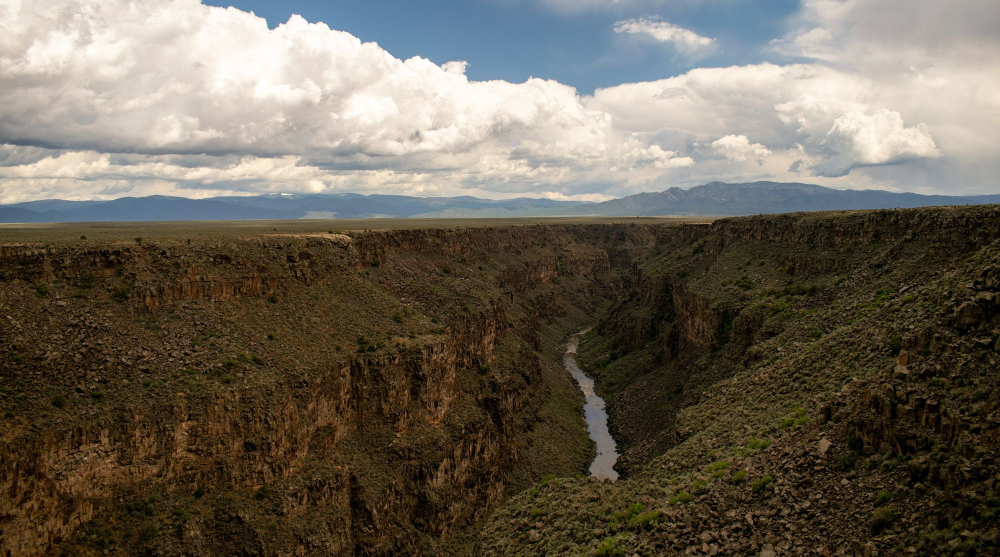
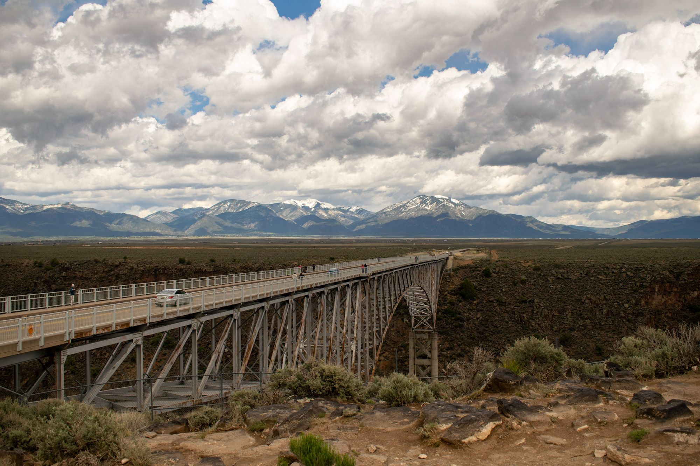

Our pre-mapped route to Taos via the iconic "high road."
After numerous recommendations from random folks on the internet, we decided that visiting Taos on the High Road was a must-do while here in New Mexico. Basically, there are two routes to Taos - one is more direct, one is more scenic but a little bit longer. You can reference the above map to get an idea for where we went and took each picture. Setting out was easy; we just followed NM84 all the way up to the highway 76 junction; as a little side note, I want to point out how slow the roads feel here in New Mexico. It seems like going over 60 miles per hour is the most dangerous thing in the world as all the highways cap at around 55. Even then, folks on the road tend to go at least 5 under. A quick search on the internet asserts that while it is true the highway speeds are slow, cops also tend to be quite lenient and speeding tickets often don't reach beyond 20 bucks, so people who want to go fast just take the risk ~ seems a bit far fetched to me but I digress. Slowness aside, the scenes were beautiful.

Our first stop was the town of Chimayo. After a quick stop at the notable Chimayo weaving trading post, we set on to visit Santuario de Chimayo, a holy place with an emphasis on forgiveness and unity.

Continuing on, we passed through the town of Truchas where we met a very nice lady who had some beautiful wood carvings. She told us that the most common types of carving wood in the area are aspen and cedar, being lighter and darker respectively. The carvings often incorporated both wood types, and all represented different sights, settings, people, or ideas.
The dwelling of the wood carver.
Soon enough, after driving through a few more towns the Chimayosos mountain range came into view, and the snow-capped peaks came clear. We drove over to a turn out in the Carson National Forest to snap some pics:

Before we knew it, we were in Taos! Driving into town we were met with some road works, but a beautiful backdrop of the Taos ski valley.

Taos has all kinds of shops, boutiques, and restaurants so we took our time walking around before sitting down for some packed lunches we'd made earlier that morning. I noticed that there was a huge cell forming in the sky with rain off in the distance, so we made haste unto the Rio Grande Gorge before the heavens opened up.

The drive to the gorge was defined by very flat, barren lands surrounded by mountains that seemingly jut from nowhere. Until we approached the edge, you could hardly notice the gorge was even there - but of course, crossing the bridge was an entirely different story.

The rain came and home we went. It was time to have a nod in the car and a good rest after our long adventure. 
