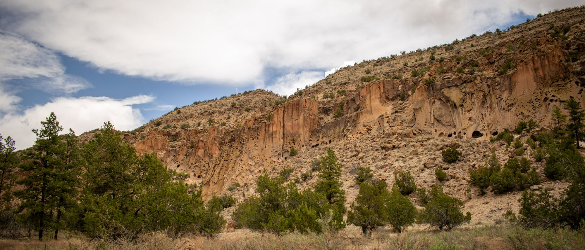
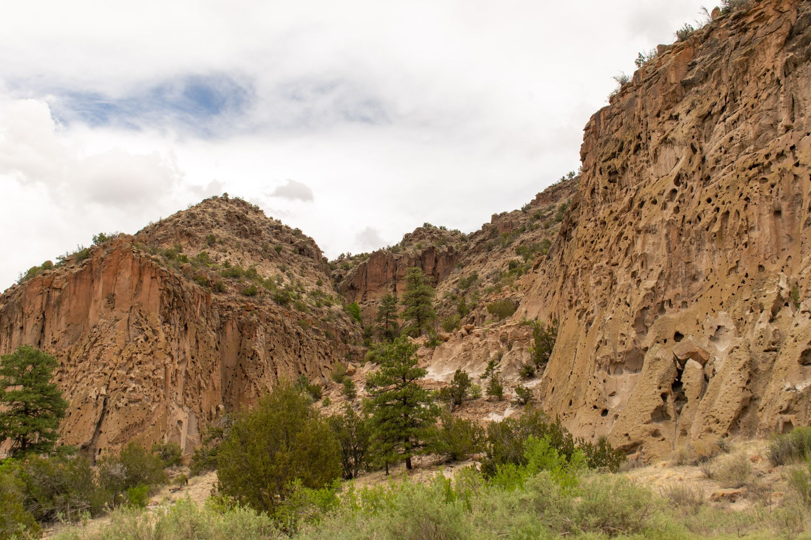
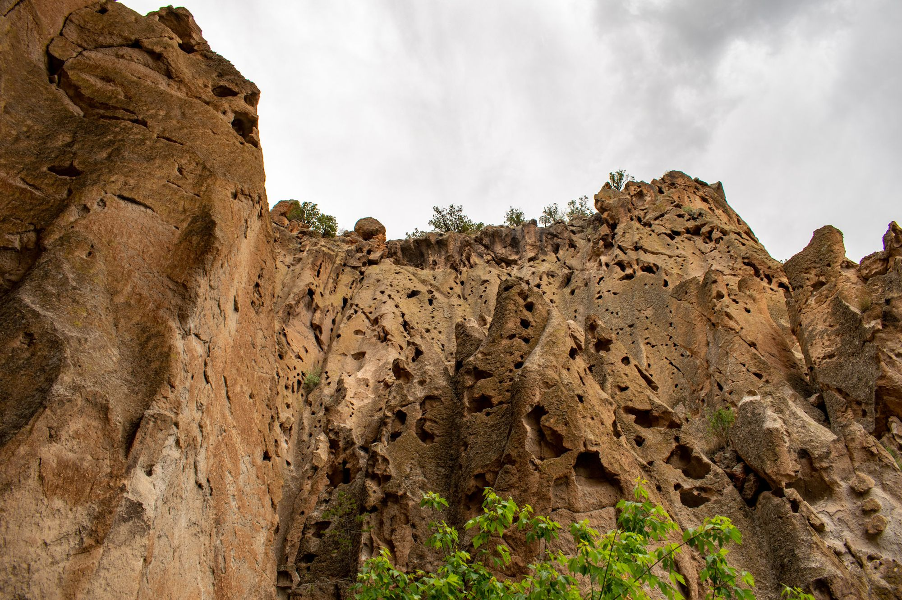
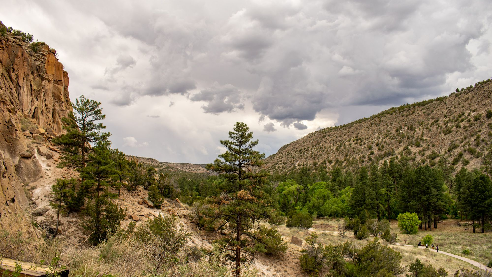
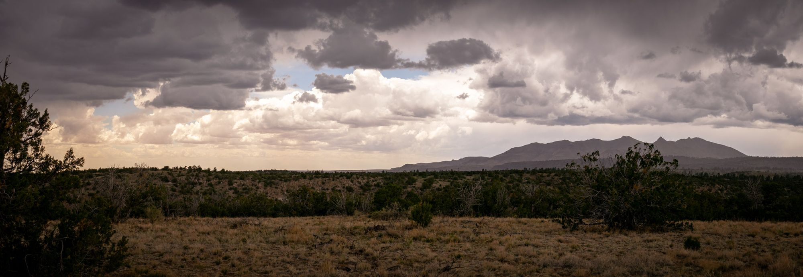
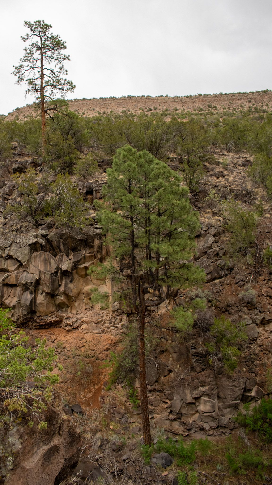
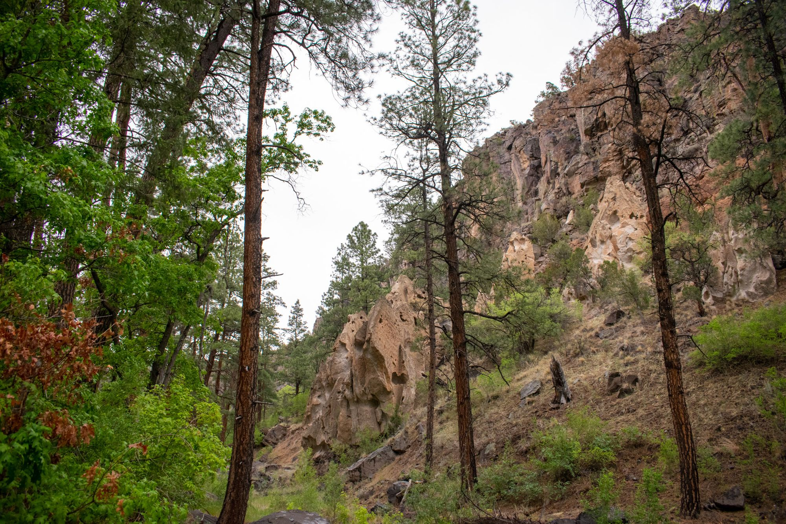
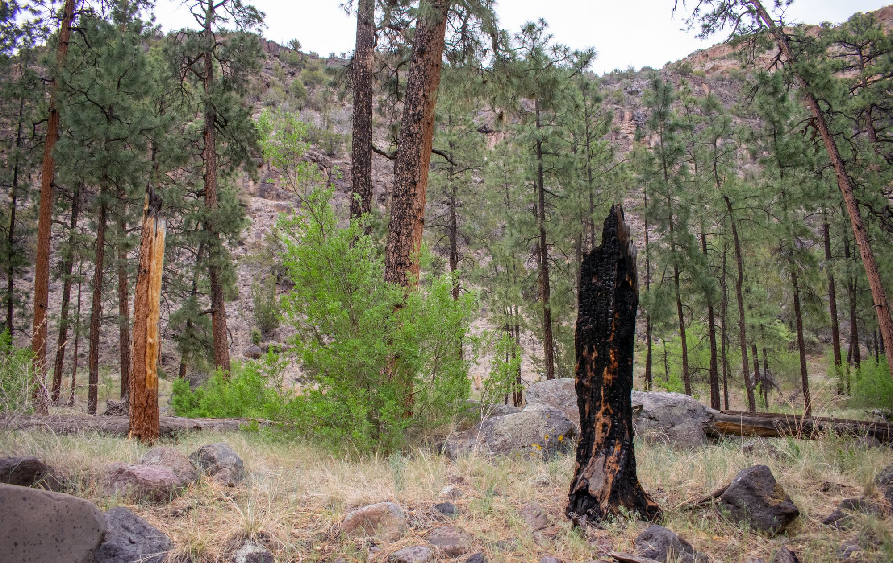
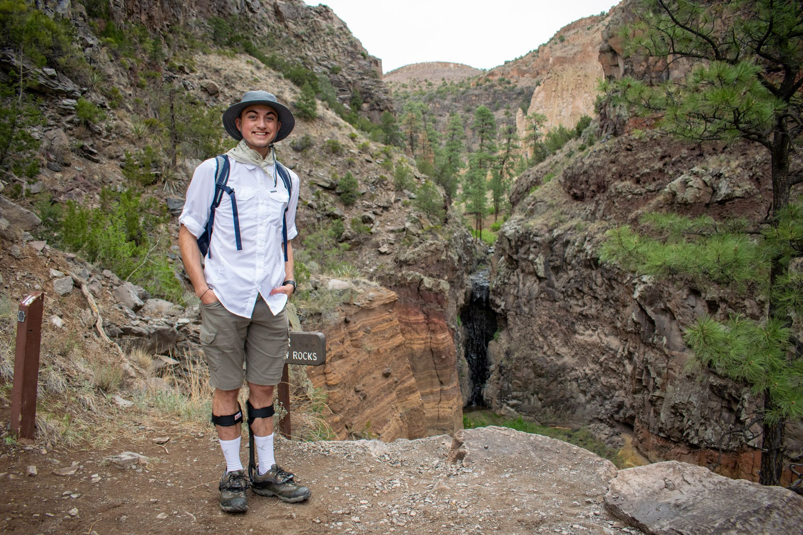

### Off we go...

Today was a planned hiking day at one of the highly recommended spots near Santa Fe called the Bandelier National Monument. We entered the canyon at around 12:30 in the afternoon, with beautiful rock formations to the right of the road beyond the trees. After parking, mom stopped by the gift shop in search of a hat which luckily we found right away. There was a masked park ranger at a table near the gift shop entrance who pointed us in the direction of the main loop trail, and we were promptly off on our little adventure.
View of the cliff dwellings from the ground at the bottom of the canyon.
The winding, paved trailed passed grids of stone-and-mortar ruins on the valley floor before we gained a bit of altitude heading into the cliff dwellings.
Approaching the cliffs
Once we began the ascent and got closer to the cliff walls, we could see more clearly the interesting erosion of the *tuff*, which is a type of volcanic rock that populates the walls of the valley. The rock type that make up Bandelier include tuff, obsidian, pumice, and basalt for the most part. Pictured below is a close up view of the cliff walls; you can clearly see the porous rock and unique shapes that would make it easy to expand into a dwelling space.

At this point, the sky was starting to transition from overcast to darker and more menacing. No matter, as we continued on through the different cliff dwelling and eventually back down to the valley floor:

From there on, I was drawn to another trailhead that apparently led up to the top of the ridge - about a 1.6 mile climb in total. My mom braved the ascent until it, inevitably, began to rain. I pressed on to see the top of the ridge as she took temporary cover under a rock. I tried to be quick, as the storm was clearly developing quickly and we didn't want to be caught in it. For my efforts, I was presented with a gorgeous view of the surrounding mountains, so I quickly snapped some pics and began my descent.
The views were incredible, but I didn't have long before I needed to return as mom was waiting for me. Spending even just a few hours outside here in New Mexico is enough to understand the natural drama that forms the basis for so many New Mexican artist's inspiration. The cloud formations, mountain ranges, and endless landscapes seem to not-so-subtly assert their dominance over you; all you can do is gaze in awe.
I found mom where we departed, and down the cliffs we went. Of course, my desire to reach the top of the ridge view trail did not come without its consequences. The heavens opened and the aforeseen storm clouds promptly dumped rain and even very small hail on us; mom decided to make a run for the home base and I walked my way there in the wet. Not wanting to give up on the day just yet, we decided to rendezvous at the little café towards the entrance and wait for the heavy rain to pass, and then we could take another trail out. About 45 minutes later after talking to the park ranger, we were directed towards the falls trail which was an easier out-and-back trail to see a small waterfall that eventually feeds into the Rio Grande.
There were lots of cool trees like this one just off the pathFires are somewhat common here (big ones every 5 years), and there was plenty of evidence of that if you kept you eyes peeled.And we made it to the waterfall!
Dinner was from an African-fusion joint called Jambo Cafe; I got a goat stew and mom got chicken peanut curry; both very good, and the roti on the side was delicious. Our impression was that it would have been even better if we could have eaten in the restaurant but still was great nonetheless. Tomorrow we are going to check out the Santa Fe farmer's market and dinner will be homemade.
