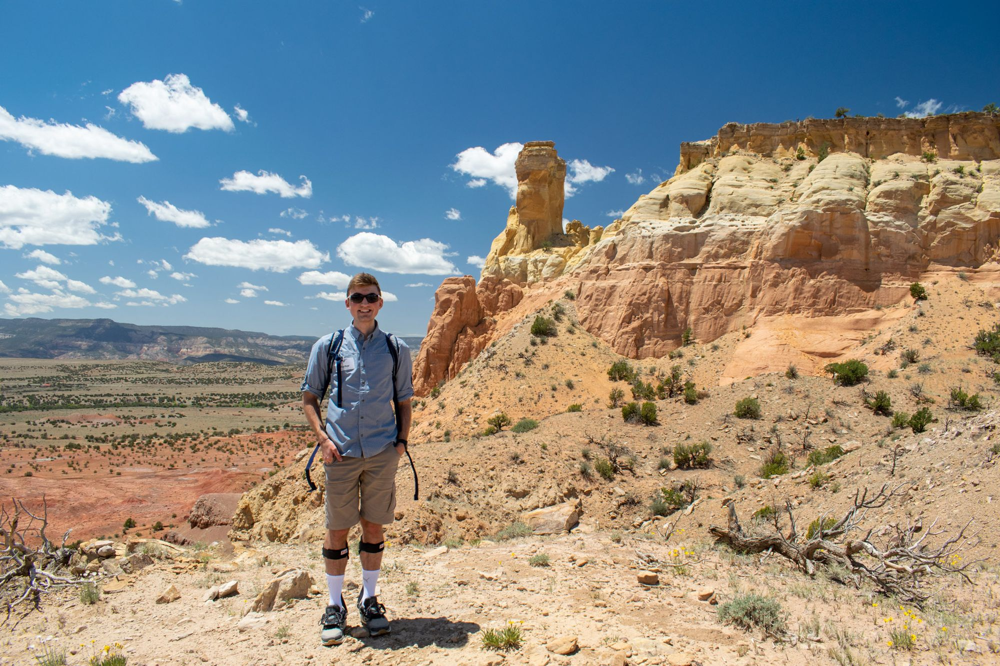
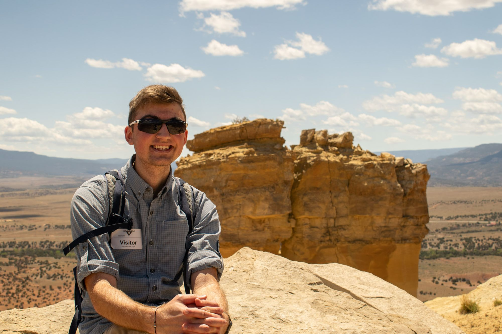
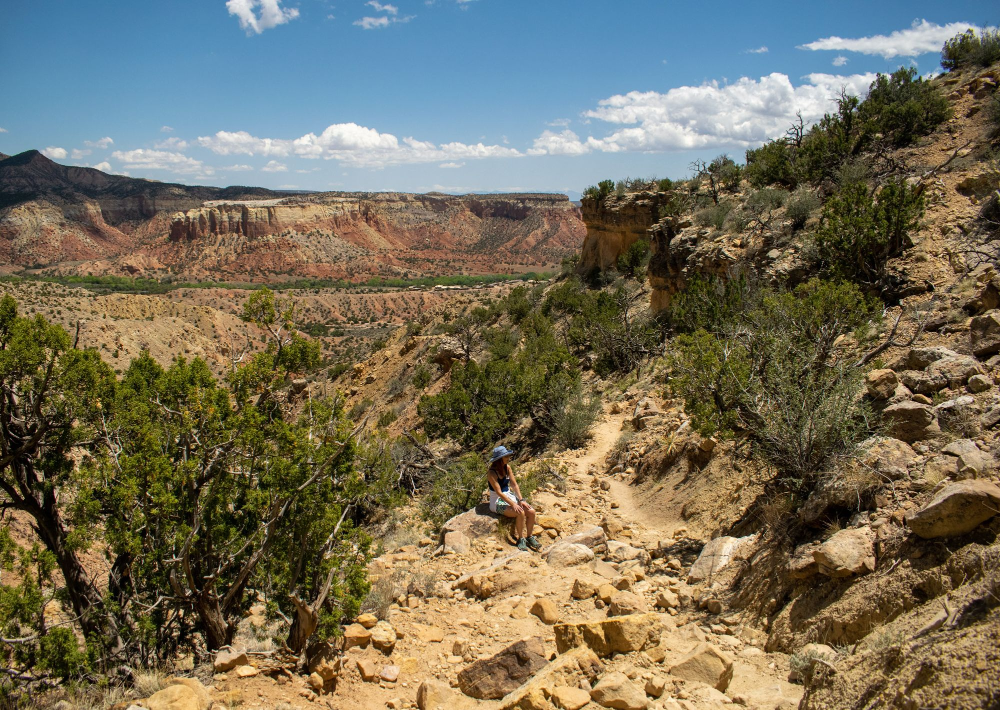

Today was a last-minute change of plans to explore the beautiful Ghost Ranch, home to the late Georgia O'Keefe and to spectacular views that were the subject of many of her pieces. For ten dollars we were granted the ability to walk the ranch and explore its popular trails. We chose to go see Chimney Rock first, as it was a moderately difficult trail that was said to be quite popular. Five minutes after starting down the trail, I turned back to awe-inspiring views of a ridge across the way.

We exchanged pictures for a passing group of Santa Fe natives and their visiting friend before continuing up the trail. Today was one of the most beautiful days we'd experienced in New Mexico - the weather was perfect. Not to mention the ambiance - the higher we ascended, the quieter it got. We just heard the occasional whistle of the wind, and nothing else.
Chimney Rock come into view from the start of the trail, but there was soon a turn-out to get a better view of it. Photo cred to my mom with my camera.
It was hard to capture the depth and scale of the rock from most of the vantage points - it is quite large. When we made it to the top, it was just about a rock's throw away:

But before that point, we had to climb up and up and up from 6,500ft at the valley floor to 7,100ft on top of the ridge.

Overall, for ten bucks the views were unbeatable. We saw a total of maybe 8 people on the trail and the diverse history of the land is super interesting. For anyone in the area, I would highly recommend coming to check out the Ghost Ranch. 

Dinner was special tonight - Happy (early) Birthday mom! We had a tapas dinner at La Boca, and while the food was nearly fantastic, I do not recommend anyone go for reasons I outline in my OpenTable review. In essence, their service was unacceptable given the price range in spite of the delicious food which sort of ruined the whole experience in my opinion. Oh well!
