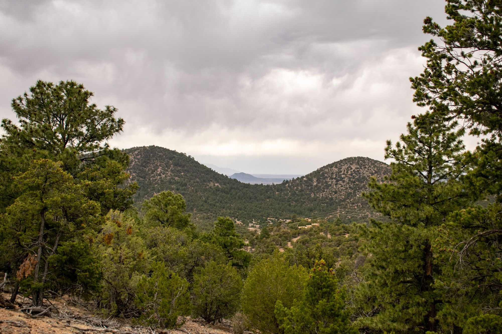
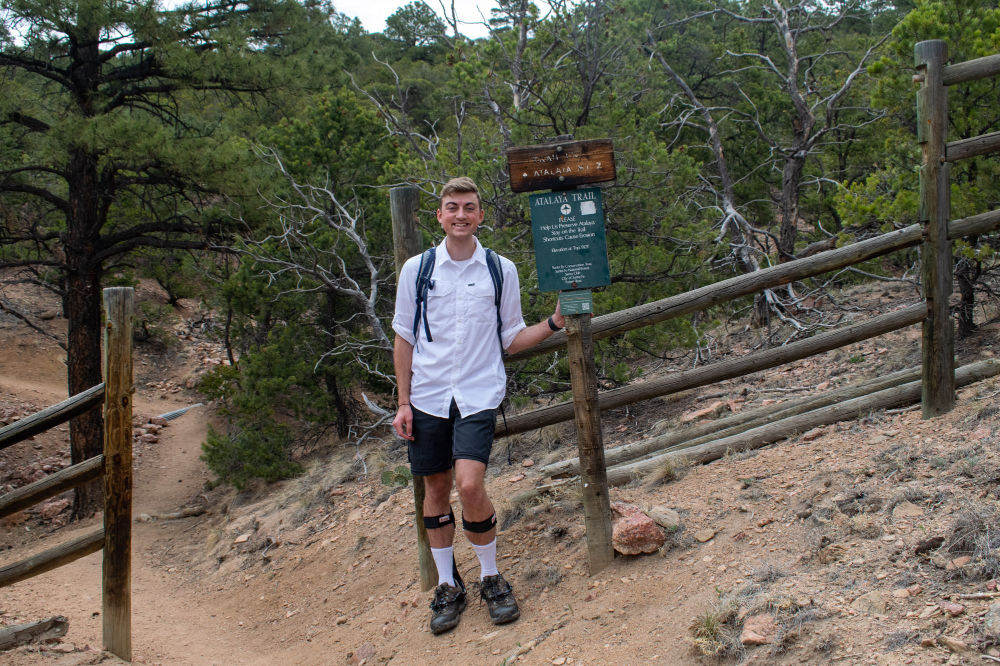

I loved this trail for a couple of reasons; namely, the trailhead was in the middle of a high-end development, and it was funny to see all these fancy homes with an actual mountain just hanging out in their backyard. The hike itself was moderately challenging, and the weather could have been better but we made the most of it.

The rolling mountain range was picturesque for most of our hike, and it didn't take long before all of Santa Fe came into view. This trail in particular was 6.2 miles out-and-back with an 1,800 foot elevation gain, although the range has hundreds of miles of trails with varied difficulty.
Me at the trailhead.
Later that evening, we went to Meow Wolf after some recommendations from various people which was an enjoyable change of pace before finishing off the day - our last full day - at our favorite Tune Up Café. Thank you for the great trip New Mexico!
