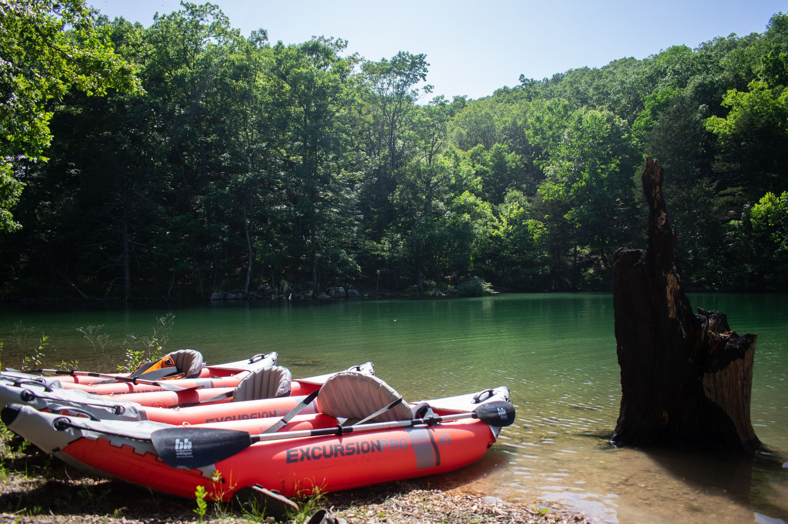
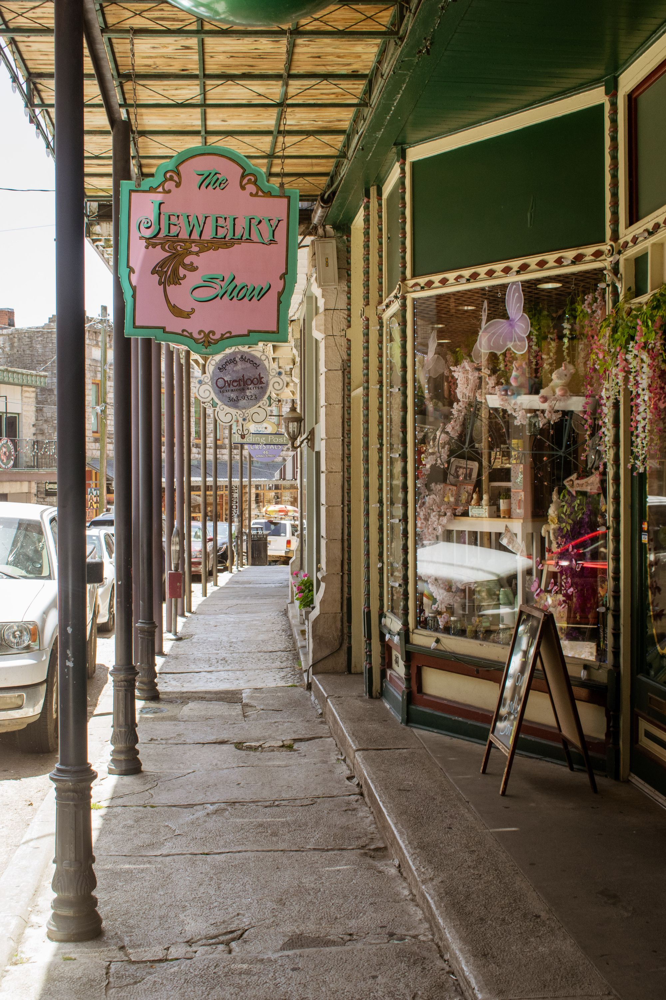
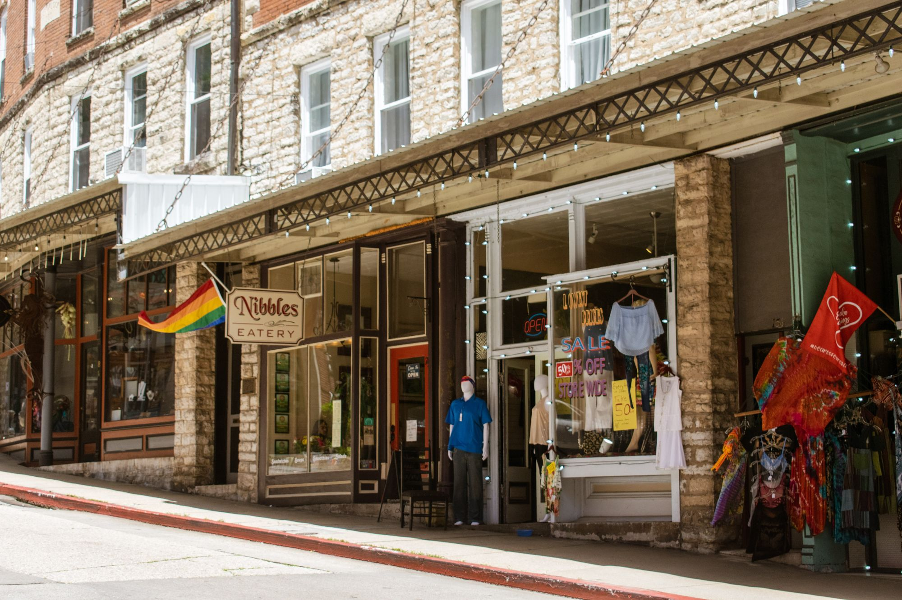
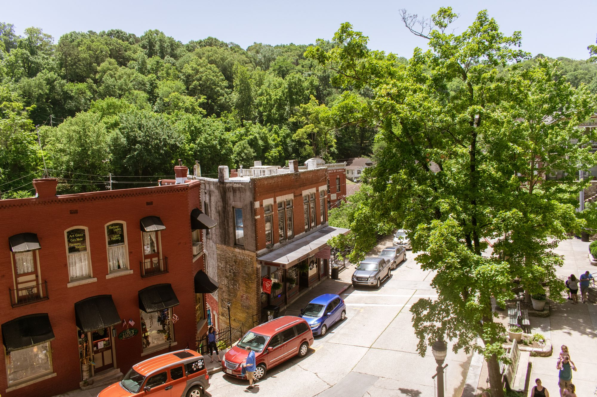
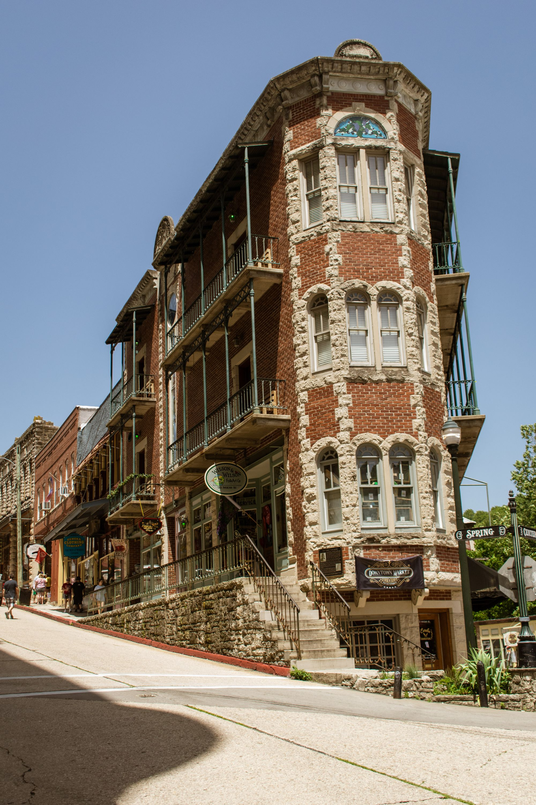
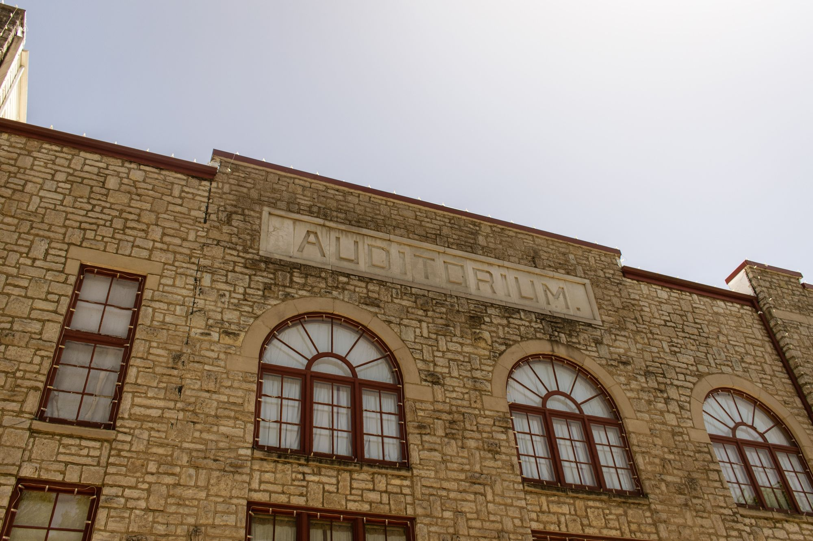
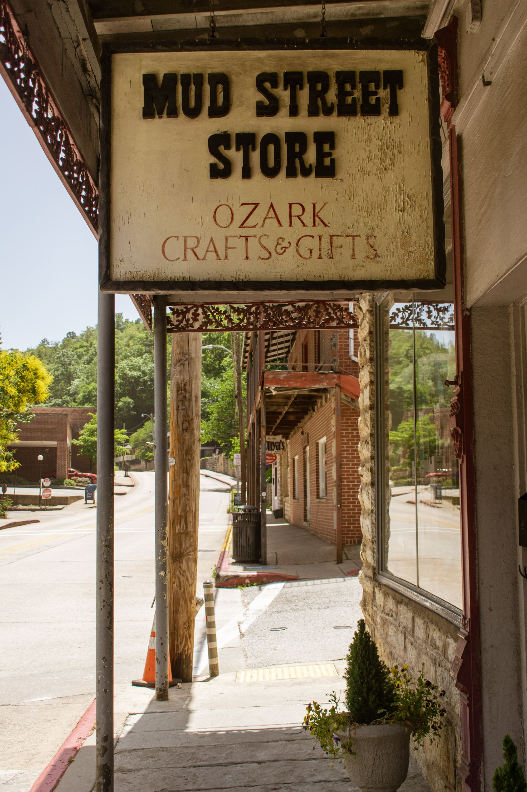
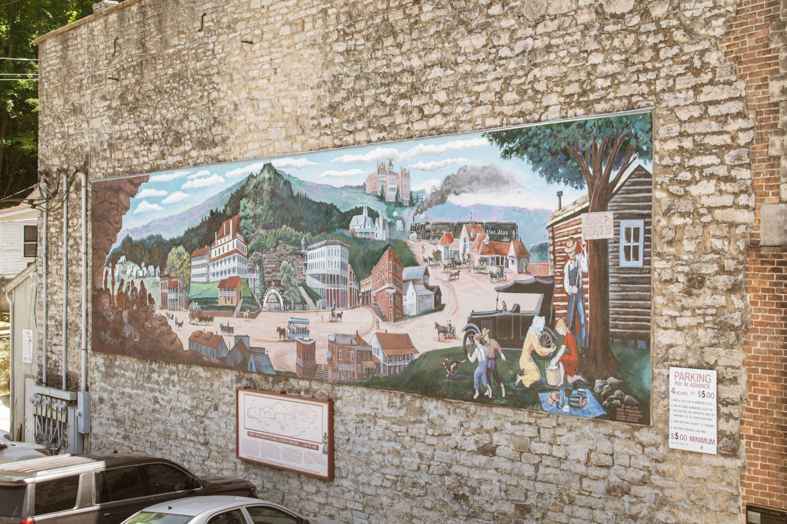
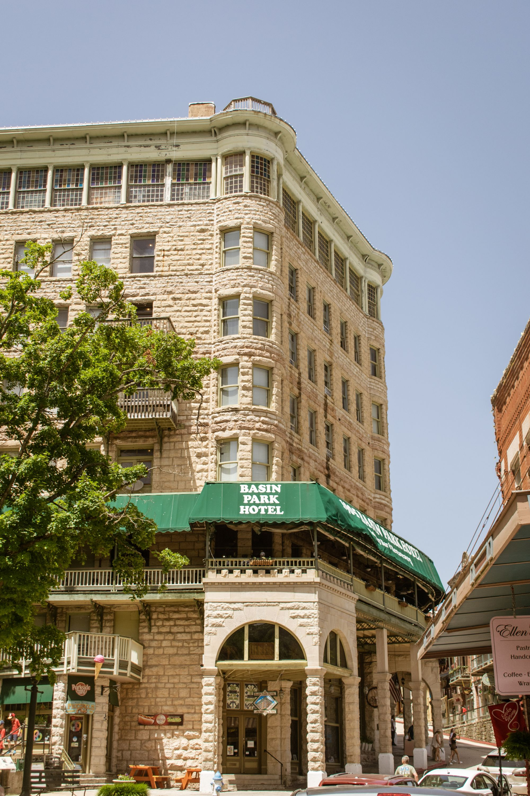
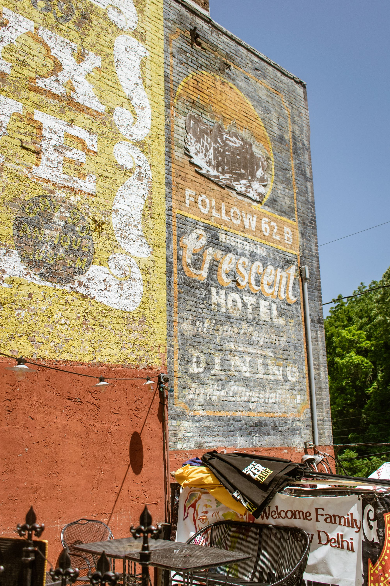

Driving after [Camp Milton](https://www.nainitiative.com/) was not too bad (except for the fact that I was pretty tired); it was just farms and country roads for four hours until the last 20 minutes when the "steep and crooked roads" set in.  I met my family at the house at around 7:30p and got all settled in - bed time was early for me where I promptly crashed for a solid 12 hours (camp will do that to you).

Our first full day in Eureka Springs was a chill day in the water; I took my time waking up, had a good breakfast, and we spent a bunch of time blowing up our inflatable kayaks to take them down to the water.
Our new kayaks were geared up and ready to test out the beautiful blue water
At this place we were staying at there was a perfect-sized cove for us to just wade around in, do some paddle boarding, or snorkel. Our neighbors to the west also shared this place, and we had to be sure they didn't try out our kayaks under the assumption that they were free-for-all (my brother-in-law had to yell down one morning to reinforce this idea).

The next day was a day in the town - after trying my very best to suppress the nausea from the "crooked and steep" roads, we made it to the historic downtown Eureka Springs with shops and food aplenty. Food was our first order of business, and in the haste to find something to eat we settled on [Balcony Restaurant & Bar](https://g.page/Balcony-Restaurant?share). It was very fried and very good :). After that it was a trip up and down the street and in and out of all the shops.

The shops were nothing spectacular and certainly nothing to write home about; we enjoyed the walking but didn't really purchase anything. Once we all had had enough, we piled back into the car for another nauseous ride back to home base. The rest of the day was filled with lake time (wading in the water and kayaking with mom) and more foodstuffs.

Day three was Wednesday, also referred to as boat day! My sister arrived and we drove out to the local marina to rent a pontoon boat. We actually ended up just taking the boat back to our little cove to beach it there and load all of our stuff onto it - worked out great :D Boat Day meant exploring Beaver Lake, and it meant getting stuck on Beaver Lake when the starter failed on the boat. A group of intoxicated college-aged boat-goers saved the day and hauled us back to shore.

A tragedy to be sure, but apparently at this point I stopped writing... I am going to publish what I did write.
