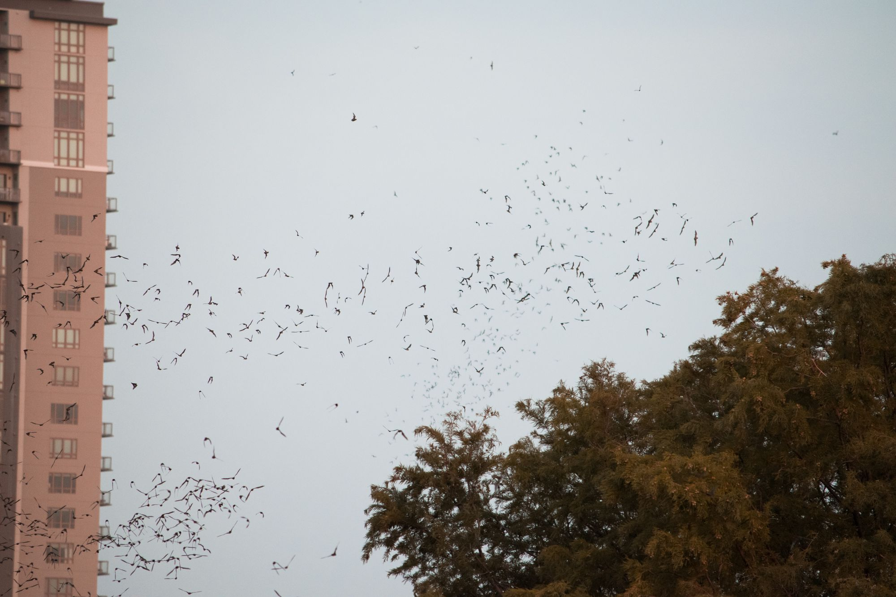

Later in the evening on Sunday night we geared up to see the bats on the SoCo bridge. The bats come out in waves at dusk, and head east on the river.

Here you can see the first wave of bats leaving the bridge and following the treeline.

The bats would also fly out in a frenzy towards the center of the river over the water-seated onlookers.

As the sun set, the sky turned a beautiful shade of yellow on the other side of the bridge.

We continued on after the bats left to explore the city a bit more.

And watched the lights come to life as the night grew darker.

