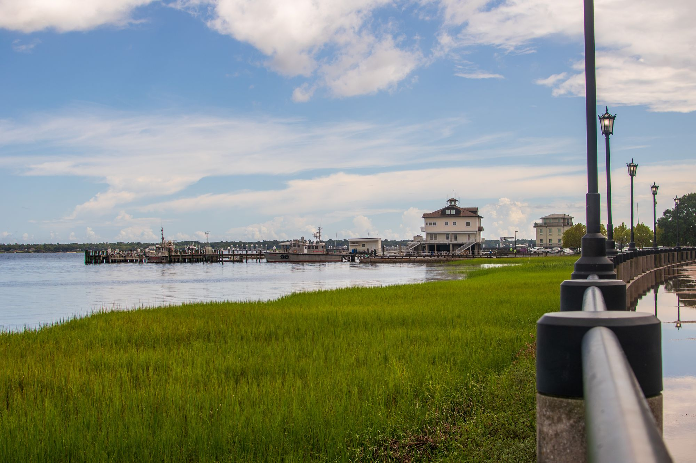
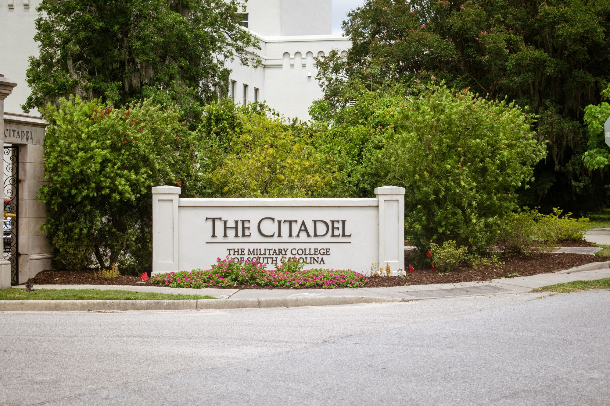
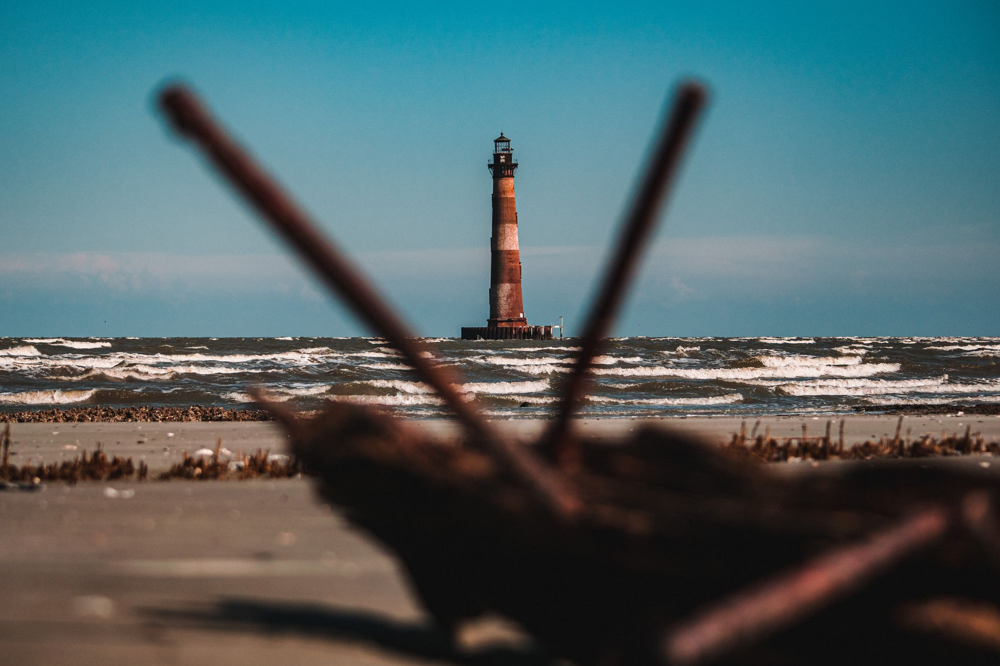

## Day 1

After a busy day for the books, my mom and I enjoyed blissful sleep and an "afternoon breakfast" over at Page's Okra (thank you to the man on the plane for your recommendation). Page's was an easy five-minute walk from our place in Mount Pleasant right off Coleman, where we treated ourselves to delicious fried green tomatoes (topped with pickled okra and homemade pimento cheese) and sweet fried chicken sandwiches. 

Solid 7/10 for me, but could have done with less sweetness on the chicken (and more spice). By the time we headed downtown via Uber, we had the pleasure of waiting around for Budget to bring us our rental car that was supposed to be ready for us, so to the visitor's center we went. The gentleman there was supremely helpful, giving us hints of information about Charleston that would ultimately prove useful. 

As we awaited some family to come visit for the rest of the day, I took some pics at the Pineapple Fountain at a waterfront park in south(ish) east Charleston:

Once we met up with them, we took a jaunt down "Rainbow Row," a collection of historical homes colored with beautiful pastels and asserting grandeur over East Bay St. Past this row of homes we reached The Battery, which is the Southern portion of Charleston's sea wall.

---

## Day 2

Today we took Middleton Place by storm! A plantation established in the mid 1700's, it boasts acres of beautiful formal gardens inspired by those in the palace of Versailles. A pair of swans greets you at the front reflection pool:

Walking onto the property, you also get a hint of the magnificent live oak (*quercus geminata)* presence that can be found in all of the greater Charleston area:

A lovely retired gentleman by the name of Joe was our tour guide for one of Middleton's garden tours. He described to us much of the history of the grounds, and pointed out so many wonderful pieces of information about the plants chosen for each particular area. Tea plants, olive tea trees, magnolias, crepe myrtles and camellia japonica all lined the walls of a grid of paths that made up the gardens:

Eventually, we stopped to admire the eldest live oak on the property, dubbed the *Middleton Oak*, in all its glory:
The *Middleton Oak* has a stoic presence on the edge of the grounds' flooded rice fields.
We finished the tour, took some final pics, met an alligator, and left to head home.

We finished off the day we a delicious meal that we cooked ourselves with the help of [Chef Bob Wagonner](http://chefbobwaggoner.com/). I had a lovely time and the food was fantastic - highly recommend!

---

## Day 3

Today we had an amazing day at the beach! Folly Beach, to be exact. Check out the pics :D The pelicans were certainly the stars of the show.

---

## Day 4

After a relaxing day at the beach, it was time for a change of pace - we woke up bright-eyed and bushy-tailed to head back over to John's Island for a kayaking tour with a guy named [Michael Coon](https://www.instagram.com/gnomemercy/), through Charleston Outdoor Adventures. Michael was supremely knowledgeable about the wildlife of the area, and the three hour tour went at an incredibly enjoyable pace. We lucked out (at the beginning) with some lovely cloud cover and bearable temperatures, but it ended a bit early when the booms and sparks of the sky rolled in.

Now, at Middleton Place, we saw the *Middleton Oak* which was a sight to behold. But we were also informed of another magnificent live oak called the *Angel Oak* on John's Island. We stopped by to take a look: 

The day concluded with a lovely lunch at Xiao Bao Biscuit (one of the best restaurants I went to in Charleston) and a long nap.

---

## Day 5

Today my mom and I spent the day dodging rain - we had a later start to the day and went to go check out The Citadel, Charleston's very own military college (and indirectly the inspiration for our trip in the first place). In high school I read *The Lords of Discipline* by Pat Conroy, and in it he describes vividly the beauty of the city. Not to mention all of the hazing and shenanigans going on there as well, but looking beyond that I thought it might be nice to come check out such a historic city.

Our first stop, with that in mind, was Hampton Park that flanks the Citadel. We walked around and observed some local wildlife before entering the military college:

The Citadel has a look and feel that is very distinct from both modern and older architecture you'd expect to see on a college campus:

Moving on from The Citadel, we figured a good indoor activity would be to visit one of the many breweries or distilleries in Charleston. Our pick was the well-known *High Wire Distillery* right next to Hampton Park:

They had a lovely spicy and aromatic gin as well as a fantastic bourbon - I got bottles of both to commemorate our time here in Charleston. Moving on, we headed straight to Market St. before the rain let loose. Our plan was to get dinner at The Cru before heading to 34 West for a lovely show of *She Drives Me Crazy*.

**Quick Restaurant Review:**
Cru Cafe had the best fried green tomatoes in Charleston. Hands down. I got the halibut-centered house special, which was a meaty steak of halibut atop a mound of thick noodles in a creamy shrimp sauce. Yummy!

34 West was not at all what I expected - an intimate affair with alcohol and snacks, every seat in the house is a good seat. It was here that I tried my first White Thai from Westbrook. Delicious! And the show was funny, light-hearted, and a great way to spend a rainy night.

---

## Day 6

As we approach the end of our time in the Charleston area, we wanted to be sure that we fully viewed all of downtown. After going to the visitor's center on day 1, we had picked up this walking-tour pamphlet for about six bucks. It proved to be a worthy resource, and helped us walk all around the residential district, south battery, and the french quarter downtown!

Later in the evening, we completed our day with a skiff-tour through COA to Morris Island to see the decommissioned lighthouse and beach. The beauty of the skiff tour is I could focus on photographing the wildlife on our way to the island, about 45 minutes each way.

Morris Island itself was well worth the wait to get there :) I found my first sand dollar! And then promptly broke it in half... But then I found another!

After getting back home, we had a yummy, low-key dinner at Art's Bar and Grill. What a fabulous fish sandwich and beer - I highly recommend.

---

## Day 7

Plantation number two today, more specifically we visited Boone Hall. A more industrialized, and productive in its time, plantation, Boone Hall focused on agriculture and brick production. We got to see an eye-opening presentation by a Gullah Geechee woman describing the work the slaves did. Listening, all I could think It is maddening that in spite of the heavily reliance on West African slave labour and knowledge of critical cash crop growing concepts (such as for rice), these people were treated as non-human; nothing more than physical property to the white man. I hope that in listening to their stories we can continue to work towards ending all facets of racism throughout the USA.

Touring around the plantation, to my surprise they grow lots of sunflowers over the Summer. We looked at the large fields of dying sunflowers and thought how beautiful they all must have been just weeks prior.

When we got back to Mount Pleasant, we focused on finding food and relaxing - the sun takes a lot out of you. I was pretty tired and laid my head down for a good hour-long nap. Afterward, I awoke to my mom having found a place called Crave to go eat at - the food was absolutely delicious (specifically their mac and cheese). I had braised short rib gnocchi which was rich and delicious. Finally, we took a walk around Shem Creek Park during golden hour.

---

## Day 8

Today was our last day, during which we enjoyed a long day on the beach again to get out all our relaxation before leaving back to Kansas. I spent a LONG time photographing pelicans, taking nearly 500 pics of dive-bombing and flying pelicans. These were some of the best/my favorites of the bunch:

Besides that, I captured some other cool beach moments. I'm gonna miss Folly Beach, it was truly lovely :D 

Charleston is a city filled with history, beauty, food, booze, and wildlife. I'd love to come back again someday!
