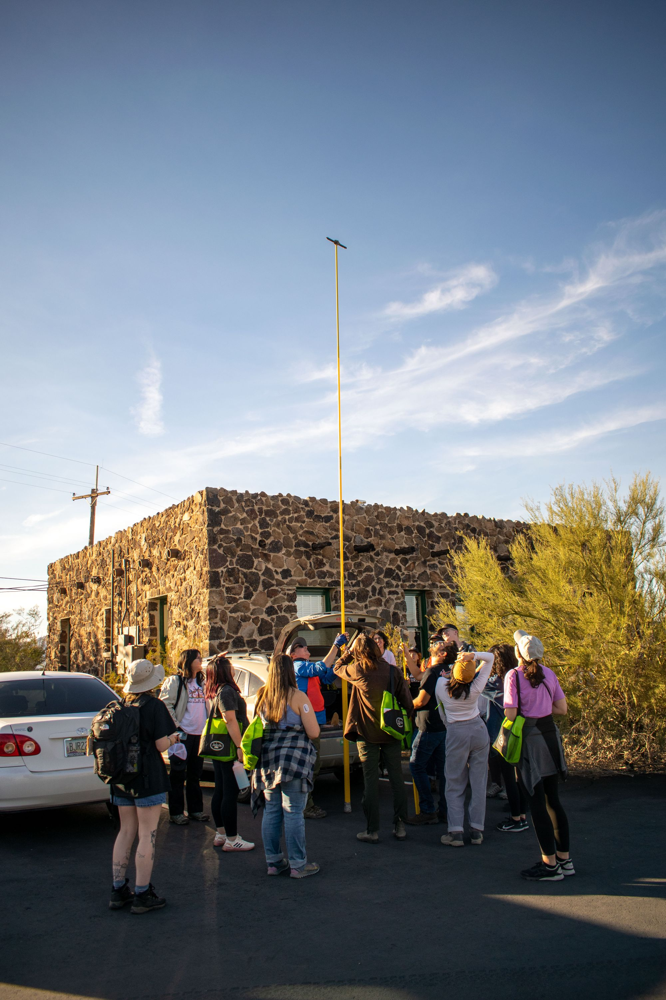
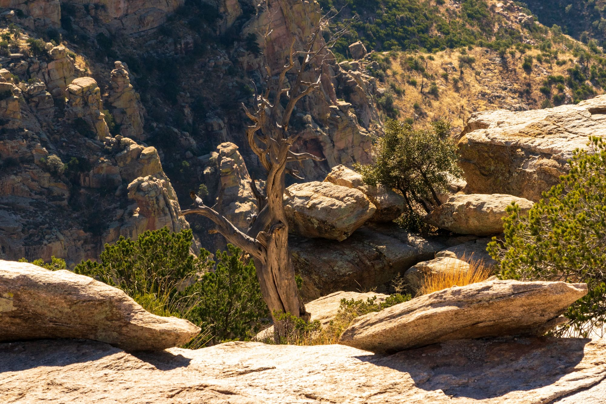

For the uninitiated, there are some background items and acronyms that you need to know to understand this trip and its importance. First of all, what is SEEDS? Standing for *Strategies for Ecology Education, Diversity, and Sustainability* and started by the Ecological Society of America (ESA), SEEDS is a program that supports a network of university-student chapters. Each chapter creates its own ways to engage with local communities, through outreach events, education support, and field work training. I have been apart of my local SEEDS chapter (KU SEEDS) for almost two years now; it has been an eye-opening experience from several perspectives. For starters, I have no explicit background in ecology - I am not minoring/dual majoring in EEOB, biology, environmental science, or even environmental engineering. What drove me to join the club was a long-standing interest in sustainability and a passion for naturalism, and my membership has only boosted that interest. Additionally, I now have a much deeper understanding of the way scientists in the field of ecology do their work, which makes me feel more attached to this community.

SEEDS as an institution exists to develop **strategies** for problems that face our world - big problems that requires bold, optimistic leadership and a mine field of new ideas. One way they achieve this is through the annual SEEDS Leadership Meeting, during which students from all across the United States gather to meet and learn from industry professionals, University faculty/researchers, graduate students, and ESA leaders. They also get to engage with the local communities, with field trips to important ecological landmarks in the area. This year, this meeting was held in Tucson at the Arizona Institute for **Resilient** Environments and Societies. I was fortunate enough to receive a nomination from my SEEDS advisor, enabling me to attend for Fall of 2022. This post is going to recount my experiences at AIRES, some state analysis of the University of Kansas and its nonexistent Office of Sustainability, and how I plan on making a difference in my own community.
ENR2 on University of Arizona's campus
On day one, we set up shop at UofA's beatiful, LEED-Platinum certified Environmetal and Natural Resources building, ENR2. LEED is a certification granted by the US government which verifies the level of sustainability (in the context of a variety of factors) of that structure. You can (and should) learn more [here](https://www.usgbc.org/leed).

ENR2 in particular had some really cool components. Thematically, it is designed to resemble a [slot canyon](https://en.wikipedia.org/wiki/Slot_canyon) in its narrow an tall foot print. To promote the reduction of maintenance required over the life of the building, most materials were very close to their raw natural state. Oxidizing steel beams facade most of the concrete and rocks. Water is also collected through channel systems of the roof and is used to water the planet throughout the building.

There were some incredible views from the top of ENR2. Students are actively doing research on bio-solar systems that provide a symbiotic look at vegetable gardening with solar energy systems.

After leaving ENR2 for the day, we needed to hand out the left over sandwiches from Baggin's - there were none left over!
A cautious student accepts the sandwhich
Where to next? It was still sunny out when we left UofA and we were heading towards Tumamoc Hill in West Tucson. This site has spectacular access to a large field of Saguaro cacti, and views of the city. It is a particularly important location for ecology and ESA. We were there to learn more (and measure some cacti :).
Archie, Iris, and Sam
One of the first things about the Saguaro that I hadn't fully realized is how big they can get - it's on the order of *stories.* By the field station itself was a Saguaro measuring over 11 meters, estimated to be **150-200 years old**.

Our act of measuring the height of the cacti with some high school trigonometry. Surprisingly accurate given the tools at hand.

The city valley was rather beautiful at this time of evening. Beyond, you see the rolling hills of Tucson and the Sonora.

In the four quadrants within the Tumamoc survey, there are over 5000 cacti whose data is being collected by researchers at UofA. Every one is tagged with these little blue tags on the ground.

Now, ecologists don't measure cacti with trigonometry in the field; they use a giant, telescoping rod that extends up to 12 meters tall. It is a rather spectacular sight, to imagine cacti taller that that.

After some time measuring, exploring, viewing some presentations, eating dinner, and meeting a Gilla Monster (Robert Anthony Villa's adoptee, aptly names Shiela Monster), we took a walk up to the top of Tumamoc Hill.
Greeted along the way by towering Saguaros

Sam and I made it to the top first, and followed by everyone else. From left to right, front to back: Eric, Sammy, Justin, Celeste, Henrique, Sam, Dev, and Maricela.
The friends I made along the way <3
---

The day after Tumamoc Hill, we put our heads down and got to work with several workshops, designed to help us communicate our science, passions, and ideas more effectively as we blossom into a new generation of leaders. We met with data scientists from the University, which was a very interesting experience from a Computer Science perspective, and having little to no background in Ecology. [David LeBauer](https://datascience.cals.arizona.edu/person/david-lebauer) articulated the importance of data in all fields of science, and I thought a lot about how I might be able to use my degree to focus more on data collection/manipulation looking into the future.

Following this panel discussion, Sandra led a valuable workshop in scientific communication. We were tasked with picking a peer-reviewed scientific paper to read, and then we walked through the process of downgrading the jargon/superfluous language to something that anyone could understand. Not only were we tasked with communicating the science, but more so the **importance** of that science; why does this thing in particular matter? My [topic of choice](https://www.researchgate.net/profile/Avery-Wang-3/publication/220723446_An_Industrial_Strength_Audio_Search_Algorithm/links/5cc89eb8a6fdcc1d49bbd379/An-Industrial-Strength-Audio-Search-Algorithm.pdf?origin=publication_detail) was Shazam's *Industrial-Strength Audio Search Algorithm*. Not having a background in ecology, I tried to pick something familiar to people for the exercise (I think lots of people are familiar with Shazam), but still something I had to downgrade effectively into layman understanding.

....

Let's just say this exercise was much more difficult than I thought it would be - but that only increased its value!

After these morning workshops, we walked out onto UofA's campus to meet Earth Grant students and Diana Liverman Scholars for a lovely vegetarian taco picnic. I met some amazing people (of widely varied backgrounds) and got to enjoy the lovely Tucson weather :)

Heading back to ENR2, we met a panel of graduate students with varied backgrounds, ready to share their experiences with us and answer any questions we might have. As I am not heading to graduate school, I saw this as a great opportunity to simply learn more about that path, especially as it relates to ecology - it was very eye-opening.

We ended the day with a think-tank breakout to develop unique ideas for how we could effectively relay what we learned during this meeting to our peers back home, and to people all over the country. I will go more into this later :)

On Saturday, it was time to hit Mount Lemmon! Not going to lie, the dry air and altitude were getting to me today. Nonetheless, it was a breathtaking experience with equally breathtaking views.

Views are better with friends :3

We made one last stop before making our descent to head back to AIRES to finish off the day (I slept the entire way down the mountain to avoid car-sickness, it worked like a charm).

*The following is an excerpt from the report that we (a collaborative effort between myself, Demmi, Sam, Isabelle, Faby, and Iris) worked on describing the adventure we had over this weekend. When it is finished I will link it here:*

> As we were traveling down the hill, we saw the difference in vegetation. At 9,000 feet, we saw larger vegetation such as the large pine trees surrounding the gift shops and town.  As we decreased in elevation while driving down the hill we saw the deciduous trees sprinkled throughout the mountains, they were bright orange and bright red  which was surprising because we were in the Sonoran Desert.  We made one quick stop on our way down Mt. Lemmon, where we saw the damage that was done during the last wildfire in the community. The Forest Service actually had a fire crew out doing a prescribed burn. The burn they were doing is considered to be a cold burn. The fire had only burned the herbaceous vegetation on the ground at the bases of the Ponderosa pine trees. We talked about how these trees need fire to sustain themselves, which is a great example of our theme of resiliency. There was a woodpecker in one of the trees, we all got to take a moment to enjoy the view and watch him doing his thing. We decided to cross the street to see the other side of the hill. The other side was completely undeveloped, which was pretty surprising. We found out that this part of the hill is too dry to be inhabited by people. We packed back into the vans, and as we continued driving down the mountain, we saw the vegetation change from trees to small bushes. Soon, we saw the sight that was familiar to us for the past few days, since we began to see the resilient saguaros take over the land. Once at the base of the mountain, we began being integrated into the outskirts of Tucson. By this time, several of us were sleeping in the van after a long day in the sun, chilly wind, and delicious meals. Some of us were a little bit carsick, but were glad to soon be back in the AIRES facility to begin our final activities.

> After a winding and long car ride down Mount Lemmon, we arrived back at AIRES and had about 15 minutes to work on our pitches that had been formed the day before. The first group pitched Eco-medy. Eco-medy was pitched as a environmental comedy tour with the overarching goal of promoting resiliency at different college campuses and schools across the nation. These would have people getting involved through local organizations and spreading sustainability hacks, sharing about what we learned at this conference, and providing the audience with resources at the end. Students and organizations could use this as an opportunity to learn about grant writing.

> The second group presented a plan to integrate the narrative of resilience by means of an interactive, easily-digestible website. This website would be a “gateway” to stories of resilience as told by members of SEEDS leadership who attended the 2022 meeting. Those stories, then, pave the way to relevant information for implementing resilience-focused leadership within the communities of our audience. The website is intended to be a stand-alone entity, something that can be shared with friends, family, and communities to hook them into an intriguing narrative and then present all the tools necessary for active resilient leadership.

> The third group presented an idea for the development of a robust lesson plan about resilience. This lesson plan would be geared towards an eighth grade writing style, so as to be the most accessible to the most people. The lesson plan would provide materials for interactivity, but also could act as a stepping-off point to spark community-wide discourse. The lesson plan might highlight different aspects of ecology alongside resilience, from use of big data in ecology, career paths in ecology, and things like governmental LEED certification.

> The fourth group pitched a social media toolkit consisting of short video clips from the conference attendees and possibly around the world. These video clips would be about resiliency and what it means to each respective individual, predominantly being used as an advertising campaign for SEEDS and how we can apply resiliency to our own community ecology. This idea would use an embedded map of how you can get involved across the country. All of us would then use our own arsenal of resources to promote these videos across social media to inspire discussions while simultaneously exposing new people to ESA SEEDS.

> After hearing all of the pitches, we then realized that many of our ideas were overlapping in several ways. At first we all tried the idea of doing every single pitch, because they could all be combined in some way, but after some discussion it was decided that this was too big of an undertaking for this group, given our respective commitments back home. After further discussion, the general consensus was that a StoryMap website that the second group pitched was the most feasible, but we could integrate the advertising that the fourth group pitched and a possible addition of the lesson plan of the third group’s. After that, Fred told us to write this.
