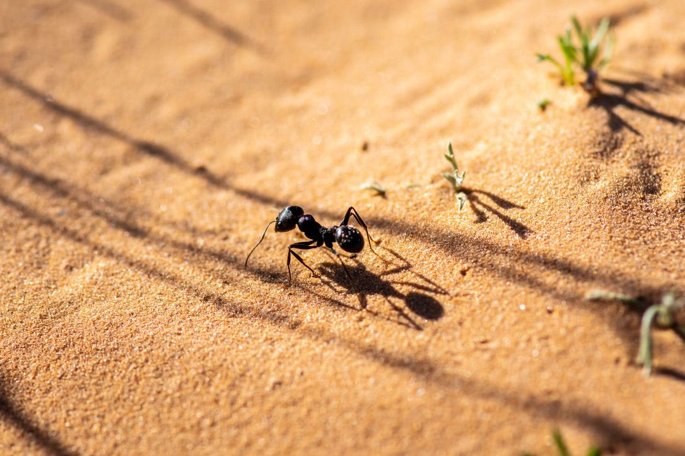

After a slower morning, still recovering from the long days of travel, I had an opportunity to return to the Wadi site on my own to continue the hunt for some lizards and get some additional photos of the habitat in that area.
Alongside the road, some grasses were growing (they reminded me of Kansas hence the photo)You can walk along the roadside to get to the wadi site and dirt road.
Flowers were establishing greater prevalence in the wadi area, and during the length of my trip carpeting was becoming more intense. These white and yellow flowers were the main flowers I saw.

The term carpeting refers to prolific growth across the sandy habitat. How might this affect the lizard's foraging abilities?
It was also really cool to see the different variation of shrubbery in different parts of Tunisia as we traveled around. In the wadi area, we found lots of larger shrubs which spread out low to the ground. This particular plant was rather unique in the area, but thought it was cool :)

Before long, I spotted my first lizard of the day! I couldn't initially identify it, but later with Maria's help we got an ID - *Acanthodactylus scutellatus*. This individual must have gotten in a fight or something, he had a little scar near his left shoulder.
*Acanthodactylus scutellatus*Flower number three - I found these to be rather beautiful.
I saw more birds as well today, and was able to get a better photo of one of the yellow wagtails (I believe this is the correct ID but am not entirely certain).

This is an earea where it was really easy to hear and find birds - they seemed very happy in this "marshy" wadi area - it was definitely the wettest part of the wadi.

This is as close as I got to another group of stilts - lots more were hanging out together on this trip out to the wadi.

It didn't take long for them to get out of dodge. Bye friends!
Lastly, some ants to round out the day. At this point I had like seven mosquito bites, so I was ready to go back - I think I spent too long by the wadi, which was prime habitat for those pests.

## MapBox
