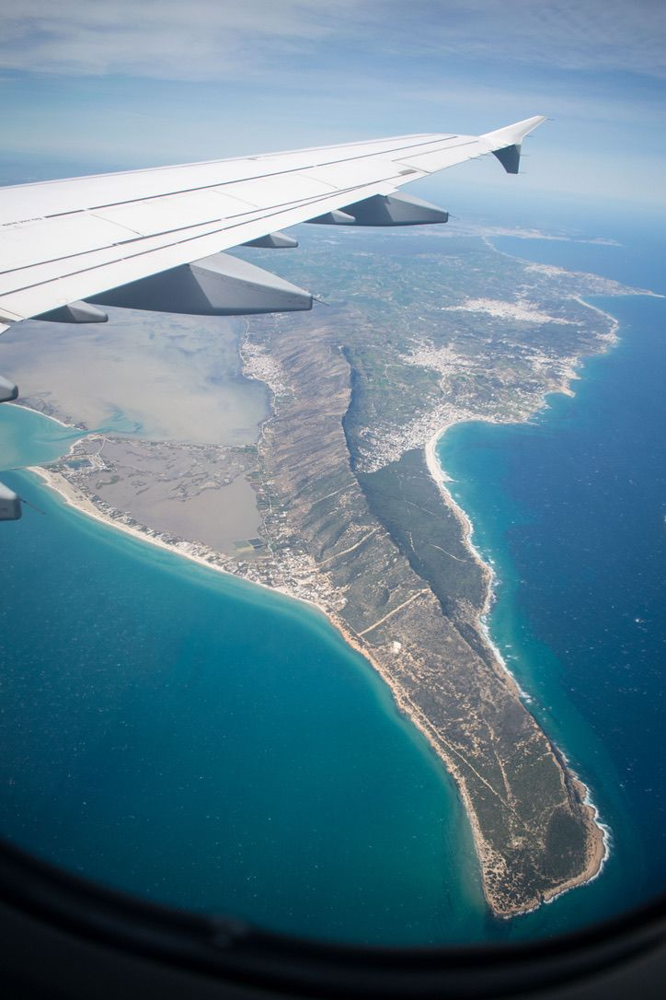
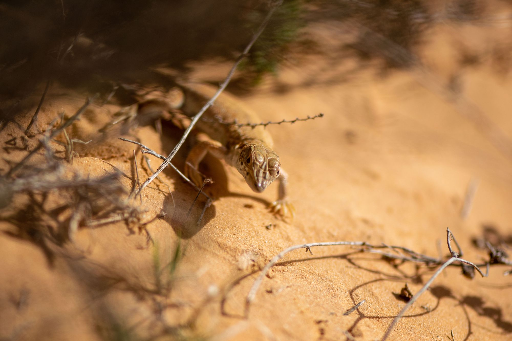
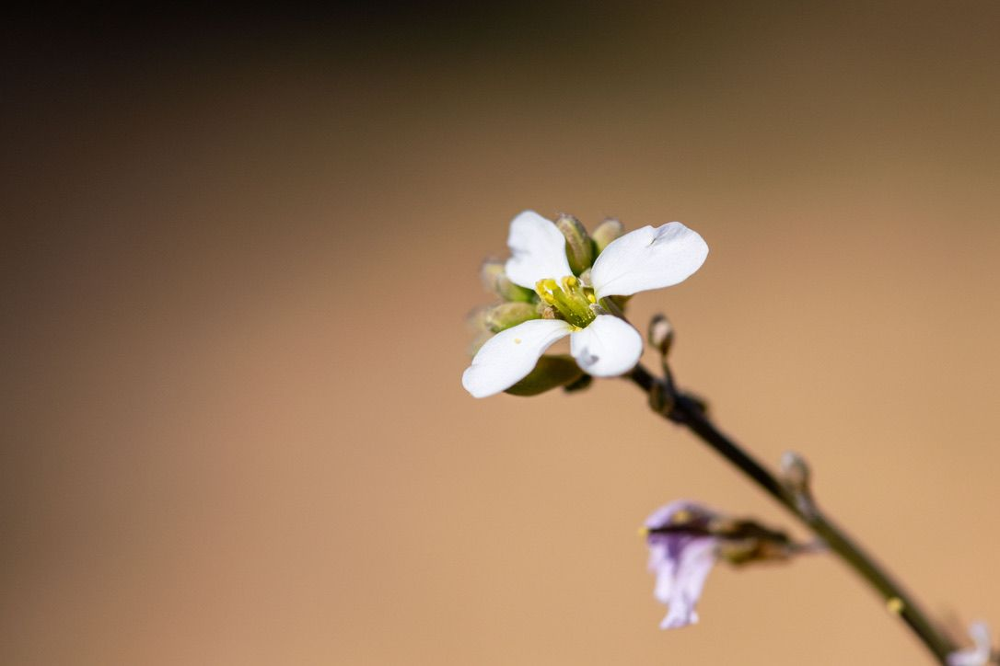
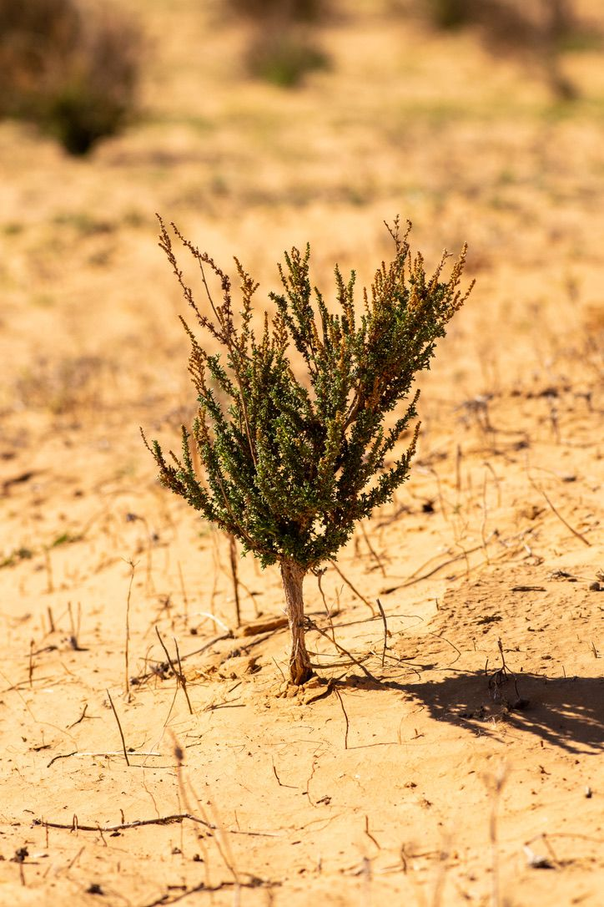
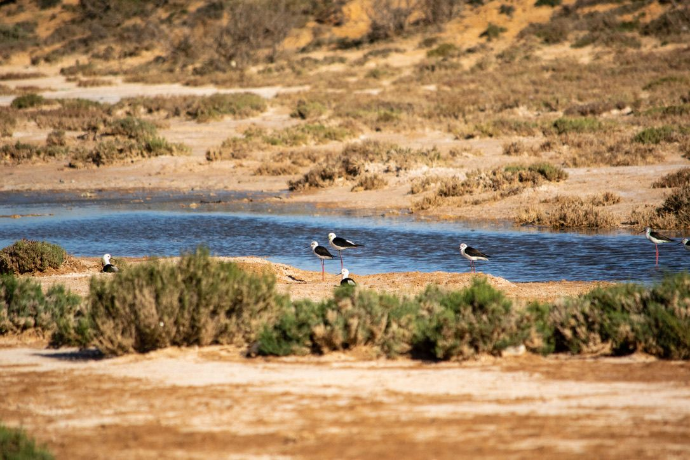
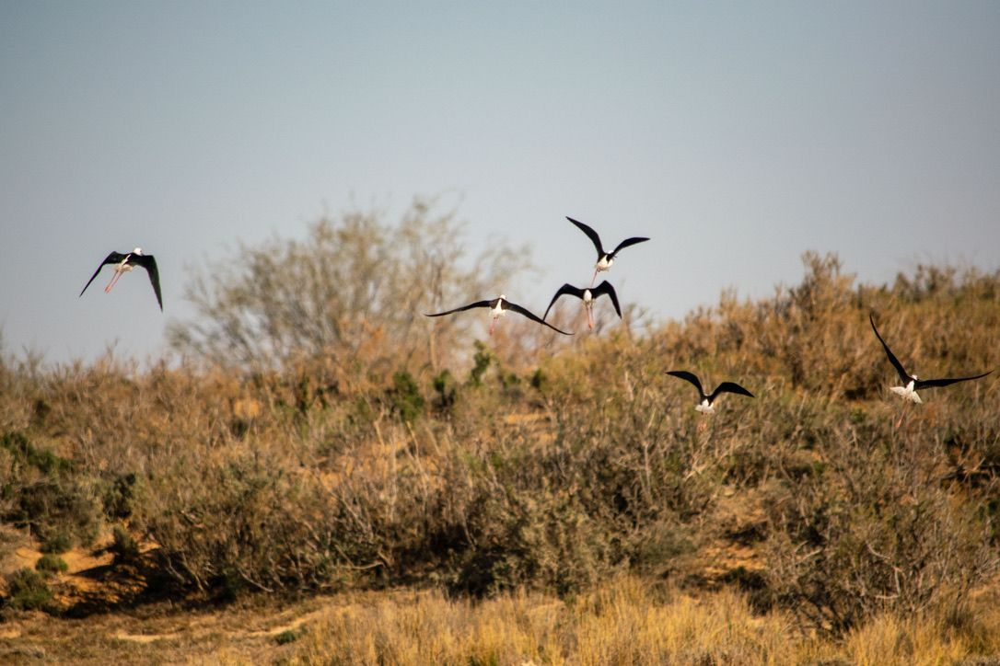
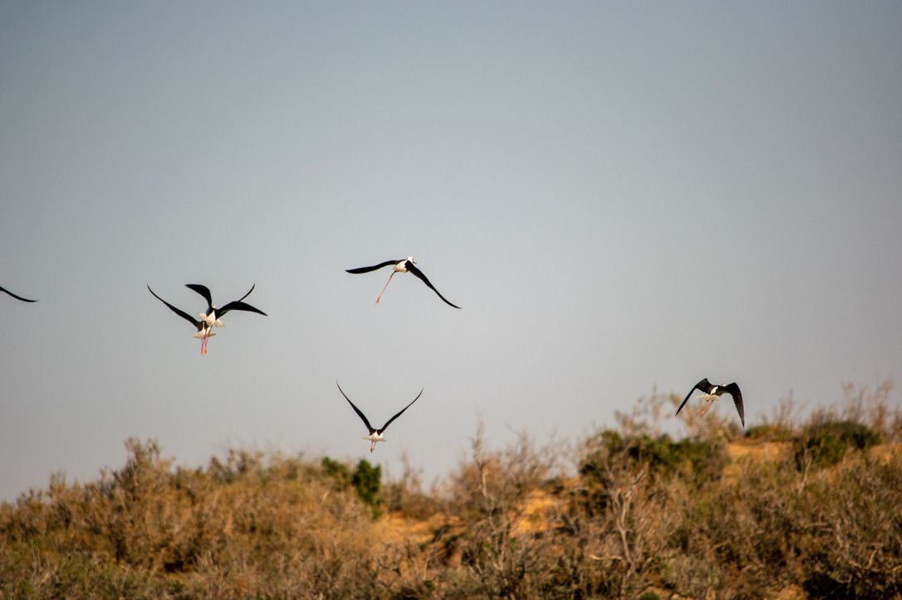
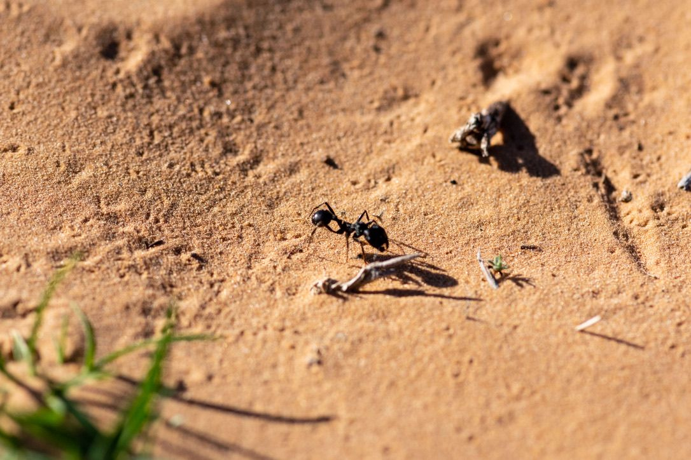
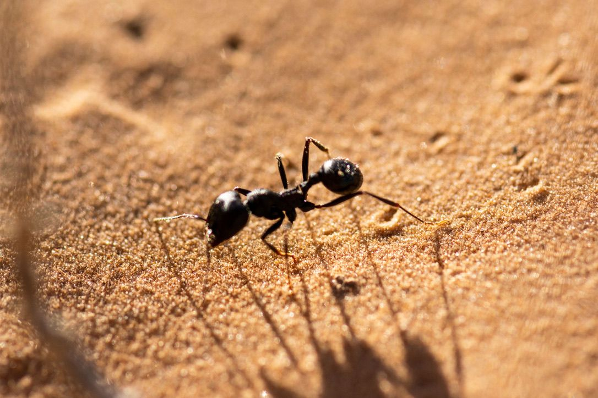

There is this feeling associated with flying to a new country that didn't really find its way to me until I was on the last plane from Frankfurt to Tunis - anticipation, urgency, excitement, awe, anxiety, preemptive exhaustion; the list goes on. I have been in an extraordinarily lucky position to have gotten to visit many places in the world throughout my life, from a variety of states to countries on two different continents. But never have I been able to visit a place quite like Tunisia.
First look at Tunisia traveling sounth-bound from Italy.
My trip to Tunisia was at the cusp of Spring, bringing about beautiful weather with highs in the low to mid 80s and with the nighttime temps rarely dipping below 40. As you might imagine, arid climates do not bring with them high humidity. By definition, arid regions only get up to 10 centimeters of rainfall per annum, and that was, in the context of the weather, pleasantly evident. You could feel your body taking the heat, but you were never drowning in it. And if you ever felt too hot, simply finding some shade would drop the temperature 20 degrees. Meanwhile, Kansas is still getting some sporadic snow events and dealing with sub-30 degree evenings... Let's just say it is a nice change of pace.

## KCI to FRA to TUN to IRA

*Friday, March 9th & Saturday, March 10th*

My flight travel from Kansas City to Tunis consisted of a little over 16 hours of total travel time, but Tunis was not my final destination. After landing, we had an additional six hour journey south towards Medenine and ultimately to the Institut des Régions Arides of Tunisia (معهد المناطق القاحلة), colloquially called IRA (phoneticaly, "EERA"). You can see the journey we took in a light teal color we took on the reference map at the [bottom of the page](#map).

Gas stations are surprisingly robust here, which was unexpected. There were multiple food options, from gelato to "pizza" (more on the pizza later), to other snacks, to pastries. I got this spinach wrap and a cold mocha which was satisfying.

Below, we stopped at another gas station after meeting up with some of my host's colleagues - you might notice the abundance of trash littered about. This is an interesting thing that I will discuss in more detail later. Nonetheless, the desert sunset was beautiful, but we still had over two hours to go, thus we continued onward.
Onlooking a powerplant with a foreground of litter and debris. Behind me, everyone else is stretching their legs after a quick bathroom break
Arriving at IRA, everything was dark and we were hungry, so we unloaded as the entrance guard grabbed my keys to let me into my room - it was perfect! I was in Guest House 1, in the south downstairs bedroom. My bedroom came equipped with a computer, a TV, large bathroom, plenty of storage and a comfortable bed. In essence, it had everything I could need or want :) 10/10 would stay there again.

I can't remember what I had for dinner, but I know it was yummy and satisfying after a *very* long trip.

## IRA-nbelievable Exploration

*Sunday, March 11th*

After a lovely breakfast of banana pancakes, coffee, dates, and general sustenance alongside some incredible conversation about the importance of creativity education, it was time to walk around IRA.

IRA is the government-supported institute for all things relating to arid regions: climate, wildlife, ecology, conservation, product research, plants - the list goes on. They support researcher's endeavors in all of these different facets while working with a limited resource pool; the work they do here at IRA is incredible and quite honestly admirable. But, it was the weekend and particularly quiet as a result, so we just walked and talked.

The houbara bustard (Chlamydotis undulata) is one of those interesting animals where some rich people enjoyed hunting them, but they hunted them too much and now are supporting captive breeding programs to bring their numbers back - this is a state of conservation status known as vulnerable. It is a particularly beautiful bird, and IRA has their own captive breeding incubator for re-release into the wild - we got to see several of them in their cages as we walked around. I find their head shape to be particularly unique and beautiful. Approaching their cages, they were very cautious of us and tended to move around to opposite sides of where we were standing.
Houbara bustard keeping a watchful eye on its observers.
IRA breeds and researches camels on-site as well. This was one of the first few times I had ever got to see a camel from up-close - initial impressions are that they are relatively laid-back animals. Of course, these particular camels exist in captivity, so they walked right up to our group and happily accepted some under-the-neck scratches. If you wanted flys for some reason, this would be the place to find them, as they circled the camel's head and body incessantly. This is the first one that approached us and kindly posed for the camera:
Camel!
I was intrigued by their eyes, which sort of developed this group around them. I don't know if that was a result of the arid climate to help keep their eyes from drying out with all of the sand. They also have big, beautiful eyelashes (also probably to help with the sand).

There were also a group of gray calves basking in the sun, rolling around on the ground. They paid no particular attention to us during our brief visit.

Baby calves <3
The adults could just barely see over the wall of their residence in order to check out their surroundings.
We meandered through the complex for a little while longer, but eventually made our way back to Guest House 4 to establish our next plan of attack and get some lunch in us. We landed on going shopping, so our next stop was going to be Boughara! This was only a 5 minute journey northwest by car.

Boughara is a small town with an market stall and some small "convenience stores" - these are places that have some basic necessities, refrigerated items, dry goods, etc in a space of maybe 75 square meters.

We parked in the town center, which wasn't busy at all today.

On the other side, there was the aforementioned open-market stall. They sold primarily produce items, including tomatoes, oranges, strawberries, dates, potatoes, red onions, two kinds of peppers, green onions, and more. We had a brief moment with the shopkeeper about the variety of peppers that they stored, trying to determine a specific variety, but really it was just "sweet" or "hot." We didn't buy any today.

A minute's walk west and we will find that other little store. I was able to get some coffee here for use in my cold brew press!
Maria, Makenna, and Doug lead me into the store
Once I got back to GH1, I finally made some coffee for the next morning. It is entirely nothing nothing special, but was quite cheap which was nice.

After coffee, I went and checked in on the rest of the gang and we collectively decided to go walk around the wadi which is a short walk east of IRA.

The wadi is essentially a sandy creek bed, which stays dry at all times *except* for the rainy season. The one by IRA is currently without much water, but there is enough to sustain the local stilts and keep your shoes muddy walking through. We followed the main road down to meet up with some sand tracks for cars to get down there. After following the tracks for a while, we eventually cut back north to head over to the complex (and eventually back home).
The sandy tracks we met up with off of the main road.
Doug had briefly mentioned sighting a mysterious beetle during his time here earlier before Spring, and had hopes that we might get the opportunity to see it again today. With our luck, it didn't take ten minutes before he spotted one. We ended up reaching out to a local scientist and friend for an ID - *Anthia sexmaculata*. There is another species in this genus which is found in southern Asia, but with some research I found that there are subtle differences. *Sexmaculata* spray poison out of their backside to aid in flight from predators.
Anthia sexmaculata
Shortly after, we found a second! This one was hurt on its back, and clearly had been through some tough stuff.
Anthia sexmaculata, hurt
Then, it happened - our first lizard of the day! If I remember correctly, Doug spotted it first to observe.

This cute lizard friend is *Acanthodactylus scutelatus*, one of several different *Acanthodactylus* species in the region. Over my time at IRA and in Tunisia in general, I really got to know and become friends with these little guys.

Finding lizards is easier after you develop what is called a **search image** for them. For me, that manifested as looking for the slight shadows that have a distinct movement pattern and size. I would walk by shrubs, and as I walk by I look for the movement patterns - if I see it, I stop moving, keep my eye on it, and try to photograph.
This is the type of shrubbery you might expect to find this particular species in. Again, this is all around the wadi by IRA.

Technically at that point we hadn’t really reached the wadi, but when we began arcing around, it came into view again very quickly.

One of the beautiful birds of this wadi is called a *stilt* - specifically, the black-winged stilt.
A Black-winged stilt waits with a friend.
With my 55-300mm lens, I have to carefully and quietly approach birds. But they can easily see me coming, and often fly off before I can get close enough to take a decent photo. The stilts behaved no differently, the groups leaving long before I could get close enough.
Bye bye birdie
Walking home, Doug stayed on the lookout for more wildlife.

We ended the day back in Boughara at the beach where I got my first glimpse of the Tunisian flamingos!
This is shot at 300mm, and they were still really far away
Fortunately, I caught some flying much closer overhead :)
Sunset flamingos
After we were done with the beach, we headed on over to the pier to meet the large clowder of kitty-cats getting ready to take on the night. They lived on and off the boats, and probably lived a happy life among the birds and fish of the pier.

## More Medenine Wildlife

After a slower morning, still recovering from the long days of travel, I had an opportunity to return to the Wadi site on my own to continue the hunt for some lizards and get some additional photos of the habitat in that area.
Alongside the road, some grasses were growing (they reminded me of Kansas hence the photo)You can walk along the roadside to get to the wadi site and dirt road.
Flowers were establishing greater prevalence in the wadi area, and during the length of my trip carpeting was becoming more intense. These white and yellow flowers were the main flowers I saw.

The term carpeting refers to prolific growth across the sandy habitat. How might this affect the lizard's foraging abilities?
It was also really cool to see the different variation of shrubbery in different parts of Tunisia as we traveled around. In the wadi area, we found lots of larger shrubs which spread out low to the ground. This particular plant was rather unique in the area, but thought it was cool :)

Before long, I spotted my first lizard of the day! I couldn't initially identify it, but later with Maria's help we got an ID - *Acanthodactylus scutellatus*. This individual must have gotten in a fight or something, he had a little scar near his left shoulder.
*Acanthodactylus scutellatus*Flower number three - I found these to be rather beautiful.
I saw more birds as well today, and was able to get a better photo of one of the yellow wagtails (I believe this is the correct ID but am not entirely certain).

This is an earea where it was really easy to hear and find birds - they seemed very happy in this "marshy" wadi area - it was definitely the wettest part of the wadi.

This is as close as I got to another group of stilts - lots more were hanging out together on this trip out to the wadi.

It didn't take long for them to get out of dodge. Bye friends!

Lastly, some ants to round out the day. At this point I had like seven mosquito bites, so I was ready to go back - I think I spent too long by the wadi, which was prime habitat for those pests.

## MapBox
