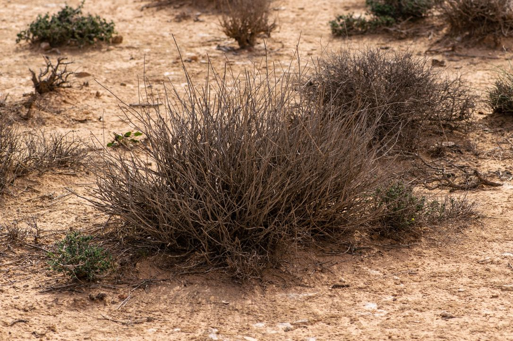
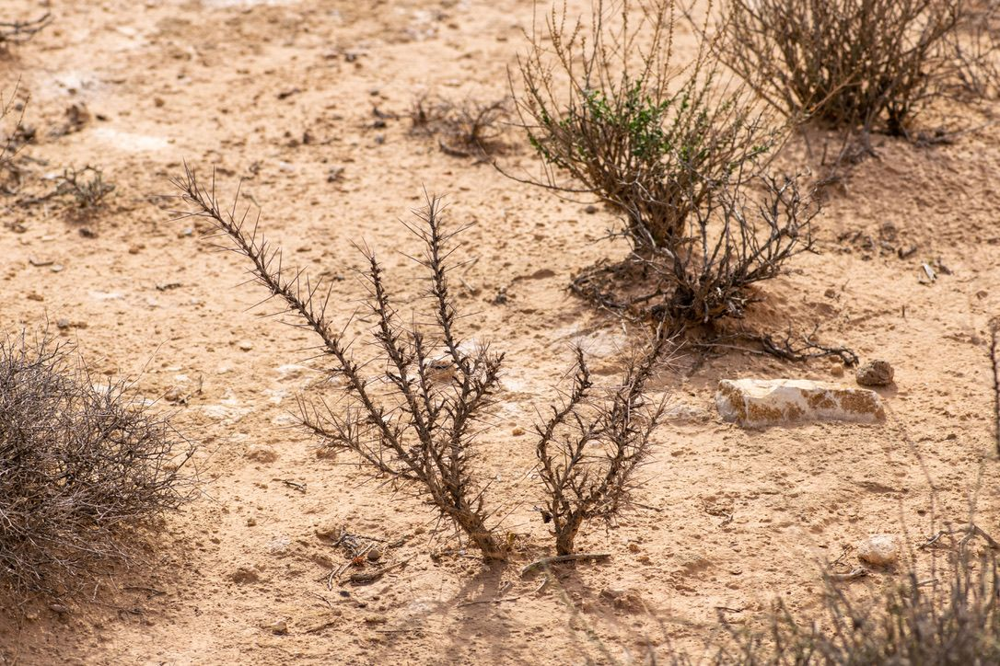

Gabes is the university that Doug and Maria help teach at, and today was a special day because we were joined by one of their students, Oumayma. Ouymayma is looking to study multiple species of lizard in the area, including *Acanthadactylus maculatus* and *Mesalina oliveria*; she wants to explore how varying pollutants influence the behavior/movement ecology of these animals.

After getting out of the car and starting to get settled into the area, the shrubbery is similar to that which we have seen elsewhere so far here in Tunisia - the bushier, wider, low-ground shrubs are probably where we could expect to find our lizards.

We saw some new varieties of flowers - very succulent-esque, with these large tubular flowers protected by rather horrifying spikes. Still pretty, though :)

It didn't take long for us to start spotting some lizards - Oumayma was the first to call Doug over to look at it with her.

She took some pics of the lizard and Doug I think attempted to catch that same one. I was in a different area looking for lizards so I started to walk over to them at this point.
Doug + lasso
This particular lizard was one of the smaller ones we had seen on this trip - *Mesalina olivera*. When the lasso approaches, they seem to have a difficult time actually seeing it, and then it lightly wraps around it to catch.
*Mesalina olivera*
It didn't take long for Oumayma to catch one of her own :)

Look how small the little guy is!!! I got to hold some of these over time and it still freaks me out - I don't wanna crush them, you know?

Makenna had lasso #3, she was also on the hunt.

We also caught another variety of *Acanthodactylus* - *maculatus*, which is just as cute if not a bit bigger than *olivieri*.

When we finished catching in this area, Oumayma needed to head back to the University. We dropped her off and headed to a relatively well-documented beach site for *A. boskianus*. This was another really cool spot, and again a potential place for study in the Summer depending on what Doug, Maria, and Makenna want to do.
Pulling into the site, we see trash, the sea, and some new shrubbery.The soil is much more sandy around here 
This area is super flat, and enabled some great long-distance views of the surround Gabes area.

Amidst all of the garbage were some really cool bones and remains, particularly this sea turtle scale.

While Maria and I walked around also looking for *boskianus*, Doug and Makenna had the lassos out and were also looking around. They found several over the time we were out there.

They had a very bright orange back which we had not yet seen around IRA.
*Acanthodactylus boskianus*
Lastly, before we left the beach after a fleeting visit, a cool looking beetle caught my eyes.

---

The next day, it was time for Makenna to head over to Italy for the weekend - a luxury of being so close to Europe is that other countries are just a hop, skip, and a jump away :) We started the day out, though, by visiting some of the empty plots across the street to look for *A. boskianus* - the search proved fruitful.

But, the finds didn't end there! Doug valiantly lifted up a sheet of metal to unveil a little scorpion friend - this is a special scorpion because it was one of the first Tunisian animals that I successfully photographed, researched, and posted to [iNaturalist](https://www.inaturalist.org/observations/151814105)*with* the correct identification, as based on the brief research I did. I present to you *Androctonous australis*.

Aaaaaand one more lizard for good measure.

Instead of driving all the way back up to Tunis where the international airport is, Makenna had a ticket out of a local municial airport on the island of Djerba - the island is only 90 minutes by car (and, in theory, shorter by ferry). We decided to take the ferry route (which ended up being a mistake in the end), but was beautiful nonetheless.
Ajim is the name of this channelAs we set off, golden hour was just minutes away.Bye-bye, mainland!15 minutes later, we approached the Djerba coastline.
The reason the ferry was a mistake was because we ended up waiting for two hours before even leaving the mainland - then we had a 30 minute drive to the airport. Makenna unfortunately didn't quite make her flight because the gentleman at the ticketing desk had other plans...

But that wraps up the next two days :)
